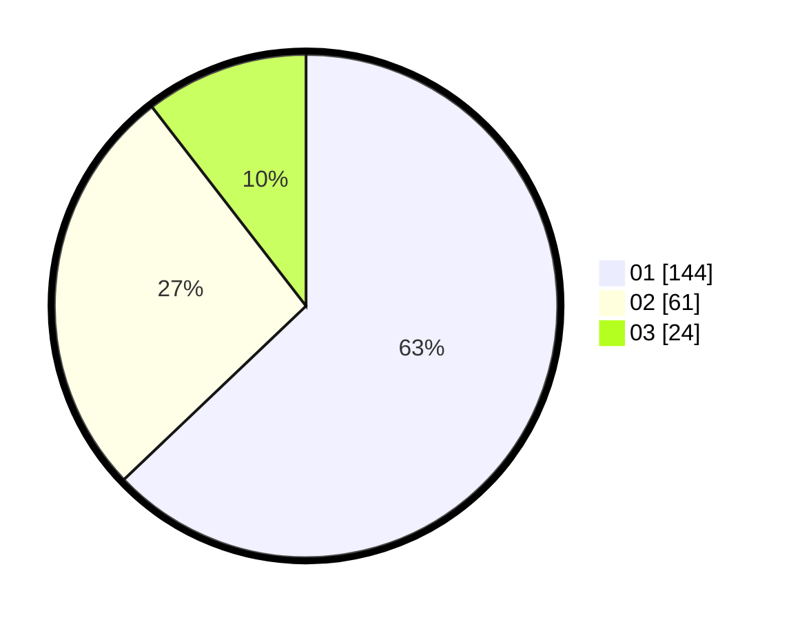

# Hasil

Hasil perolehan suara paslon dapat dilihat pada file paslon-01.txt, paslon-02.txt, dan paslon-03.txt.

Jika tidak ada, artinya data tersebut belum ada pada SIREKAP.

## Perolehan Suara

 * Paslon 01: **144**.
 * Paslon 02: **61**.
 * Paslon 03: **24**.

## Foto C Plano

https://sirekap-obj-formc.kpu.go.id/15dd/pemilu/ppwp/31/73/05/10/01/3173051001068-20240215-013906--652fb86e-ebb1-4af6-a898-d0ec957b02ee.jpg

https://sirekap-obj-formc.kpu.go.id/15dd/pemilu/ppwp/31/73/05/10/01/3173051001068-20240215-014018--e6827973-427a-4308-bb5b-9db6ab9f312d.jpg

https://sirekap-obj-formc.kpu.go.id/15dd/pemilu/ppwp/31/73/05/10/01/3173051001068-20240215-032155--98deb0c3-1817-4266-84fa-e5e73760af97.jpg

## DATA PEMILIH TETAP

Jumlah pemilih dalam DPT: **283**.
 * L: **142**.
 * P: **141**.

## DATA PENGGUNA HAK PILIH

Jumlah pengguna hak pilih dalam DPT: **226**.
 * L: **106**.
 * P: **120**.

Jumlah pengguna hak pilih dalam DPTb: **3**.
 * L: **2**.
 * P: **1**.

Jumlah pengguna hak pilih dalam DPK: **2**.
 * L: **1**.
 * P: **1**.

Jumlah pengguna hak pilih: **231**.
 * L: **109**.
 * P: **122**.

## JUMLAH SUARA SAH DAN TIDAK SAH

JUMLAH SELURUH SUARA SAH: **229**.

JUMLAH SUARA TIDAK SAH: **2**.

JUMLAH SELURUH SUARA SAH DAN SUARA TIDAK SAH: **231**.
