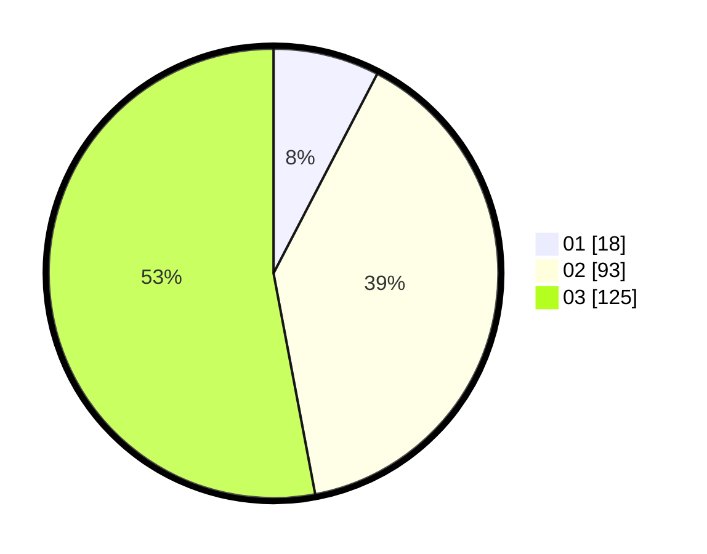

# Hasil

Hasil perolehan suara paslon dapat dilihat pada file paslon-01.txt, paslon-02.txt, dan paslon-03.txt.

Jika tidak ada, artinya data tersebut belum ada pada SIREKAP.

## Perolehan Suara

 * Paslon 01: **18**.
 * Paslon 02: **93**.
 * Paslon 03: **125**.

## Foto C Plano

https://sirekap-obj-formc.kpu.go.id/7b70/pemilu/ppwp/31/73/05/10/01/3173051001074-20240214-155305--f3ff6981-6b78-4078-ac88-6f070b52219c.jpg

https://sirekap-obj-formc.kpu.go.id/7b70/pemilu/ppwp/31/73/05/10/01/3173051001074-20240214-155404--6d364ff3-300a-46e1-96ad-cf5ffe84bbce.jpg

https://sirekap-obj-formc.kpu.go.id/7b70/pemilu/ppwp/31/73/05/10/01/3173051001074-20240214-155504--f0a75265-fe3f-4b30-b840-ca6e05c289a3.jpg

## DATA PEMILIH TETAP

Jumlah pemilih dalam DPT: **280**.
 * L: **131**.
 * P: **149**.

## DATA PENGGUNA HAK PILIH

Jumlah pengguna hak pilih dalam DPT: **218**.
 * L: **100**.
 * P: **118**.

Jumlah pengguna hak pilih dalam DPTb: **18**.
 * L: **4**.
 * P: **14**.

Jumlah pengguna hak pilih dalam DPK: **1**.
 * L: **0**.
 * P: **1**.

Jumlah pengguna hak pilih: **237**.
 * L: **104**.
 * P: **133**.

## JUMLAH SUARA SAH DAN TIDAK SAH

JUMLAH SELURUH SUARA SAH: **236**.

JUMLAH SUARA TIDAK SAH: **1**.

JUMLAH SELURUH SUARA SAH DAN SUARA TIDAK SAH: **237**.
