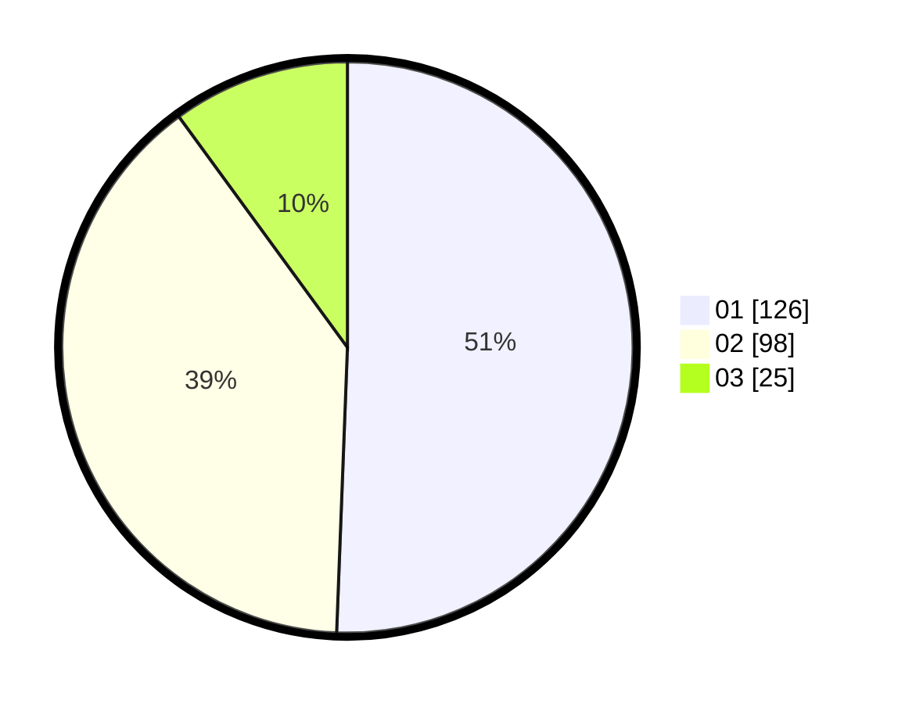

# Hasil

Hasil perolehan suara paslon dapat dilihat pada file paslon-01.txt, paslon-02.txt, dan paslon-03.txt.

Jika tidak ada, artinya data tersebut belum ada pada SIREKAP.

## Perolehan Suara

 * Paslon 01: **126**.
 * Paslon 02: **98**.
 * Paslon 03: **25**.

## Foto C Plano

https://sirekap-obj-formc.kpu.go.id/478b/pemilu/ppwp/31/73/05/10/01/3173051001076-20240214-233919--8d3d460c-71e1-4bdf-8459-a5bd12d6f9a7.jpg

https://sirekap-obj-formc.kpu.go.id/478b/pemilu/ppwp/31/73/05/10/01/3173051001076-20240214-234056--bee71814-4445-43ee-8bc8-65b9bd90641c.jpg

https://sirekap-obj-formc.kpu.go.id/478b/pemilu/ppwp/31/73/05/10/01/3173051001076-20240214-234206--de5a0f7c-2da6-4012-b845-bdfbb0f5ca8a.jpg

## DATA PEMILIH TETAP

Jumlah pemilih dalam DPT: **282**.
 * L: **150**.
 * P: **132**.

## DATA PENGGUNA HAK PILIH

Jumlah pengguna hak pilih dalam DPT: **247**.
 * L: **126**.
 * P: **121**.

Jumlah pengguna hak pilih dalam DPTb: **2**.
 * L: **1**.
 * P: **1**.

Jumlah pengguna hak pilih dalam DPK: **4**.
 * L: **2**.
 * P: **2**.

Jumlah pengguna hak pilih: **253**.
 * L: **129**.
 * P: **124**.

## JUMLAH SUARA SAH DAN TIDAK SAH

JUMLAH SELURUH SUARA SAH: **249**.

JUMLAH SUARA TIDAK SAH: **4**.

JUMLAH SELURUH SUARA SAH DAN SUARA TIDAK SAH: **253**.
