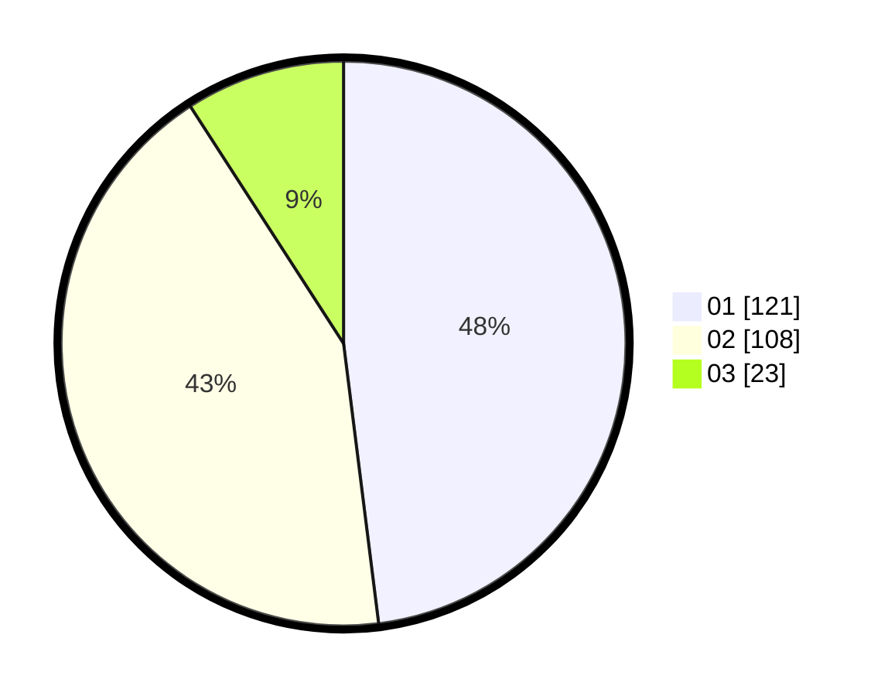

# Hasil

Hasil perolehan suara paslon dapat dilihat pada file paslon-01.txt, paslon-02.txt, dan paslon-03.txt.

Jika tidak ada, artinya data tersebut belum ada pada SIREKAP.

## Perolehan Suara

 * Paslon 01: **121**.
 * Paslon 02: **108**.
 * Paslon 03: **23**.

## Foto C Plano

https://sirekap-obj-formc.kpu.go.id/eb03/pemilu/ppwp/31/73/05/10/01/3173051001080-20240215-020459--dccc6c0a-dc61-4037-97e0-189608ce4561.jpg

https://sirekap-obj-formc.kpu.go.id/eb03/pemilu/ppwp/31/73/05/10/01/3173051001080-20240214-220355--ad5ba2b8-e051-426a-aa82-b082ba6d8973.jpg

https://sirekap-obj-formc.kpu.go.id/eb03/pemilu/ppwp/31/73/05/10/01/3173051001080-20240215-020831--4893606a-a8a1-4e1e-a51c-1cb5a958236a.jpg
