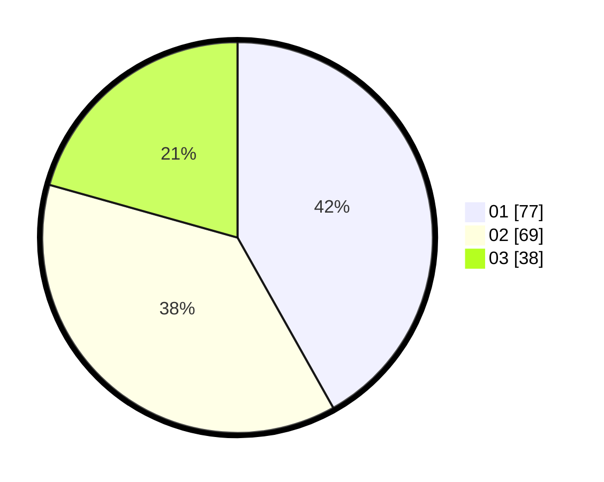

# Hasil

Hasil perolehan suara paslon dapat dilihat pada file paslon-01.txt, paslon-02.txt, dan paslon-03.txt.

Jika tidak ada, artinya data tersebut belum ada pada SIREKAP.

## Perolehan Suara

 * Paslon 01: **77**.
 * Paslon 02: **69**.
 * Paslon 03: **38**.

## Foto C Plano

https://sirekap-obj-formc.kpu.go.id/50b3/pemilu/ppwp/31/73/05/10/01/3173051001084-20240215-003740--2d683ca9-7630-4b69-96d2-19980134d852.jpg

https://sirekap-obj-formc.kpu.go.id/50b3/pemilu/ppwp/31/73/05/10/01/3173051001084-20240215-003751--a374d932-89cd-4bc4-9000-b42bc215bca2.jpg
