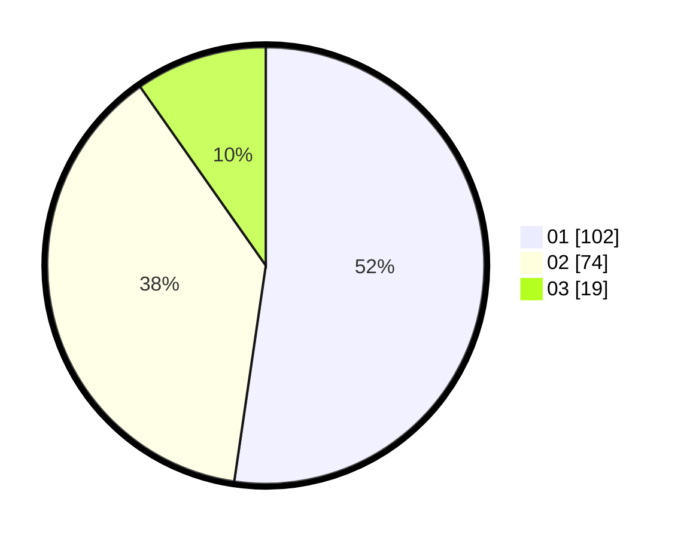

# Hasil

Hasil perolehan suara paslon dapat dilihat pada file paslon-01.txt, paslon-02.txt, dan paslon-03.txt.

Jika tidak ada, artinya data tersebut belum ada pada SIREKAP.

## Perolehan Suara

 * Paslon 01: **102**.
 * Paslon 02: **74**.
 * Paslon 03: **19**.

## Foto C Plano

https://sirekap-obj-formc.kpu.go.id/121b/pemilu/ppwp/31/73/05/10/01/3173051001086-20240214-212856--61ef962b-6aa3-4f6d-8226-88c4e9645696.jpg

https://sirekap-obj-formc.kpu.go.id/121b/pemilu/ppwp/31/73/05/10/01/3173051001086-20240214-213053--80fe9bd0-e6be-49e9-9191-7046c07eca87.jpg

https://sirekap-obj-formc.kpu.go.id/121b/pemilu/ppwp/31/73/05/10/01/3173051001086-20240214-213240--b591c3cb-c53a-4a61-be74-a68b3206ec9e.jpg
