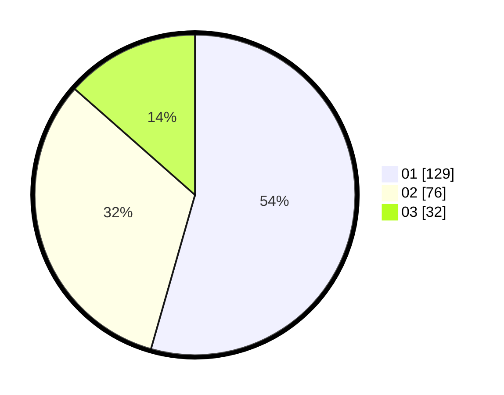

# Hasil

Hasil perolehan suara paslon dapat dilihat pada file paslon-01.txt, paslon-02.txt, dan paslon-03.txt.

Jika tidak ada, artinya data tersebut belum ada pada SIREKAP.

## Perolehan Suara

 * Paslon 01: **129**.
 * Paslon 02: **76**.
 * Paslon 03: **32**.

## Foto C Plano

https://sirekap-obj-formc.kpu.go.id/cb32/pemilu/ppwp/31/73/05/10/01/3173051001089-20240214-215732--16938413-44b9-4db7-9a0e-44dd52bdfd39.jpg

https://sirekap-obj-formc.kpu.go.id/cb32/pemilu/ppwp/31/73/05/10/01/3173051001089-20240214-215839--db21f590-ef5b-42c2-81a6-5f49e2f661d8.jpg

https://sirekap-obj-formc.kpu.go.id/cb32/pemilu/ppwp/31/73/05/10/01/3173051001089-20240214-220012--4bbdcd94-fad7-44ed-91f8-d3f8e0480126.jpg
