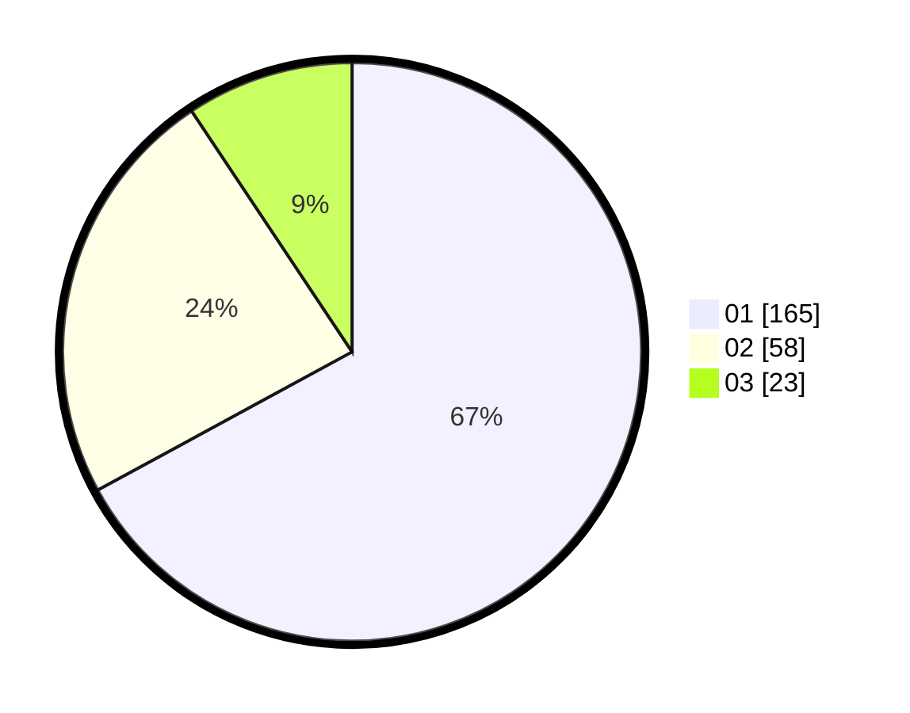

# Hasil

Hasil perolehan suara paslon dapat dilihat pada file paslon-01.txt, paslon-02.txt, dan paslon-03.txt.

Jika tidak ada, artinya data tersebut belum ada pada SIREKAP.

## Perolehan Suara

 * Paslon 01: **165**.
 * Paslon 02: **58**.
 * Paslon 03: **23**.

## Foto C Plano

https://sirekap-obj-formc.kpu.go.id/21c6/pemilu/ppwp/31/73/05/10/01/3173051001090-20240214-221746--5054623b-4114-47c4-afa0-534fc59e0d00.jpg

https://sirekap-obj-formc.kpu.go.id/21c6/pemilu/ppwp/31/73/05/10/01/3173051001090-20240214-221849--db953639-3203-4588-99d7-2717e8cc7c75.jpg

https://sirekap-obj-formc.kpu.go.id/21c6/pemilu/ppwp/31/73/05/10/01/3173051001090-20240214-221933--0b61126f-eb07-486b-968a-3c7e02b49622.jpg
