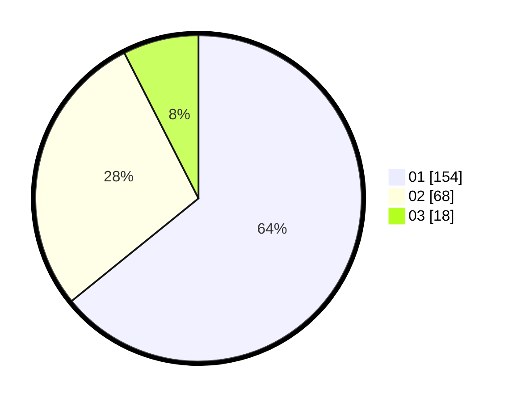

# Hasil

Hasil perolehan suara paslon dapat dilihat pada file paslon-01.txt, paslon-02.txt, dan paslon-03.txt.

Jika tidak ada, artinya data tersebut belum ada pada SIREKAP.

## Perolehan Suara

 * Paslon 01: **154**.
 * Paslon 02: **68**.
 * Paslon 03: **18**.

## Foto C Plano

https://sirekap-obj-formc.kpu.go.id/2367/pemilu/ppwp/31/73/05/10/01/3173051001097-20240214-232748--5e5cbb30-b4e9-497d-b34d-ebfab6533222.jpg

https://sirekap-obj-formc.kpu.go.id/2367/pemilu/ppwp/31/73/05/10/01/3173051001097-20240214-232859--012e8d71-14a8-4409-8752-eb9c8c792279.jpg

https://sirekap-obj-formc.kpu.go.id/2367/pemilu/ppwp/31/73/05/10/01/3173051001097-20240214-233003--b1778f1f-4ead-47c2-9332-8e4e0710e572.jpg
