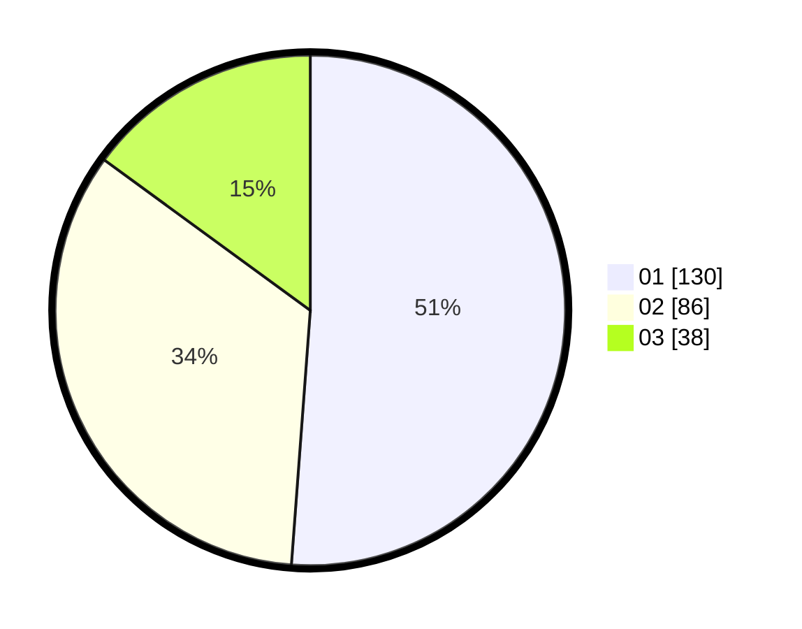

# Hasil

Hasil perolehan suara paslon dapat dilihat pada file paslon-01.txt, paslon-02.txt, dan paslon-03.txt.

Jika tidak ada, artinya data tersebut belum ada pada SIREKAP.

## Perolehan Suara

 * Paslon 01: **130**.
 * Paslon 02: **86**.
 * Paslon 03: **38**.

## Foto C Plano

https://sirekap-obj-formc.kpu.go.id/4012/pemilu/ppwp/31/73/05/10/01/3173051001098-20240214-222247--786c6f28-fce7-4c4d-ac31-699790bc3288.jpg

https://sirekap-obj-formc.kpu.go.id/4012/pemilu/ppwp/31/73/05/10/01/3173051001098-20240214-222408--a743e4e3-afe5-45bd-989f-2c8f28ff8022.jpg

https://sirekap-obj-formc.kpu.go.id/4012/pemilu/ppwp/31/73/05/10/01/3173051001098-20240214-222452--7b90e126-b7b3-41b8-b795-ca0991293b8e.jpg
