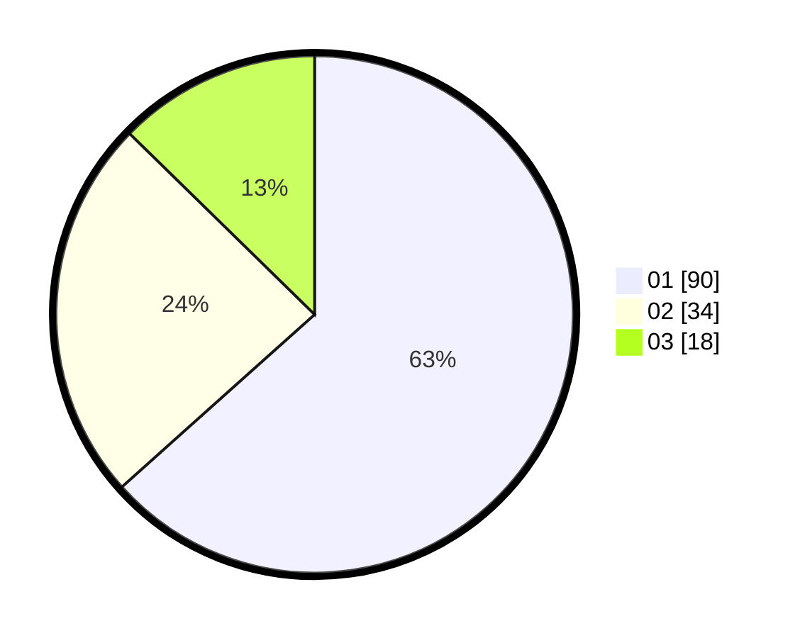

# Hasil

Hasil perolehan suara paslon dapat dilihat pada file paslon-01.txt, paslon-02.txt, dan paslon-03.txt.

Jika tidak ada, artinya data tersebut belum ada pada SIREKAP.

## Perolehan Suara

 * Paslon 01: **90**.
 * Paslon 02: **34**.
 * Paslon 03: **18**.

## Foto C Plano

https://sirekap-obj-formc.kpu.go.id/b26a/pemilu/ppwp/31/73/05/10/01/3173051001100-20240214-141512--145d308c-78dd-4f03-bb9f-017f3bf9199b.jpg

https://sirekap-obj-formc.kpu.go.id/b26a/pemilu/ppwp/31/73/05/10/01/3173051001100-20240214-141609--43c1194f-04c5-4626-ae52-a61e12313fe0.jpg

https://sirekap-obj-formc.kpu.go.id/b26a/pemilu/ppwp/31/73/05/10/01/3173051001100-20240214-141134--c8d92fde-8fe1-48d6-8ceb-383ef9e7a730.jpg
