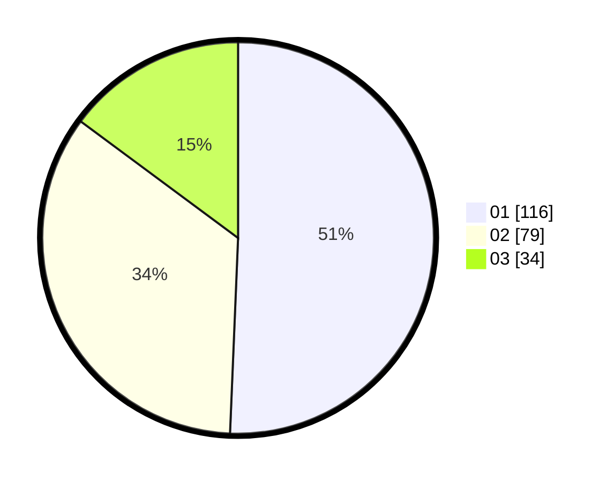

# Hasil

Hasil perolehan suara paslon dapat dilihat pada file paslon-01.txt, paslon-02.txt, dan paslon-03.txt.

Jika tidak ada, artinya data tersebut belum ada pada SIREKAP.

## Perolehan Suara

 * Paslon 01: **116**.
 * Paslon 02: **79**.
 * Paslon 03: **34**.

## Foto C Plano

https://sirekap-obj-formc.kpu.go.id/ec5d/pemilu/ppwp/31/73/05/10/01/3173051001101-20240215-010213--281958a1-81bf-4814-8b2a-0e1fe046cc68.jpg

https://sirekap-obj-formc.kpu.go.id/ec5d/pemilu/ppwp/31/73/05/10/01/3173051001101-20240215-010419--2da7231b-16b4-4dff-809f-ac47f17ac9af.jpg

https://sirekap-obj-formc.kpu.go.id/ec5d/pemilu/ppwp/31/73/05/10/01/3173051001101-20240215-010608--440041ac-8969-487c-98cf-2b4646294640.jpg
