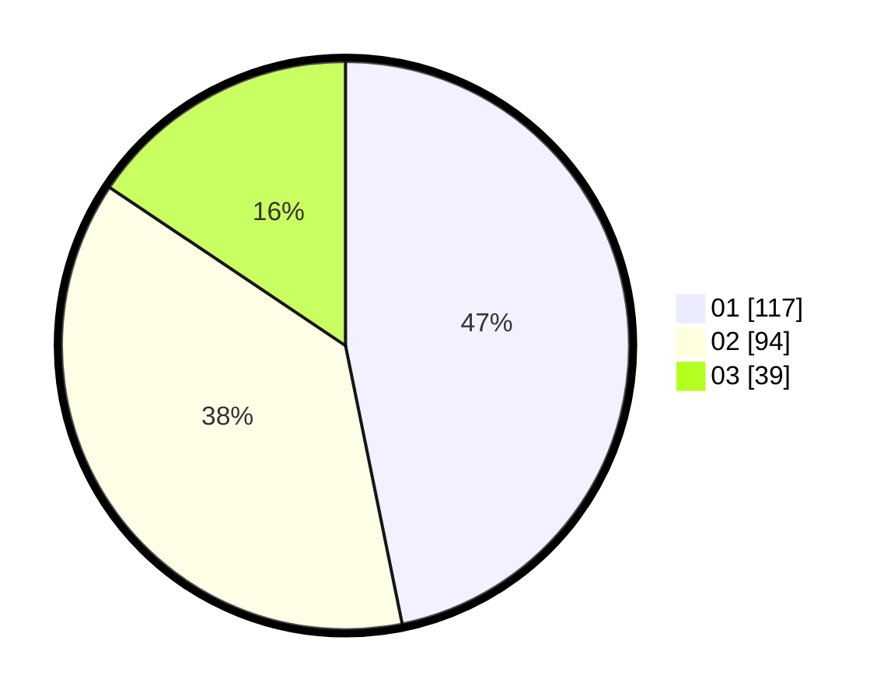

# Hasil

Hasil perolehan suara paslon dapat dilihat pada file paslon-01.txt, paslon-02.txt, dan paslon-03.txt.

Jika tidak ada, artinya data tersebut belum ada pada SIREKAP.

## Perolehan Suara

 * Paslon 01: **117**.
 * Paslon 02: **94**.
 * Paslon 03: **39**.

## Foto C Plano

https://sirekap-obj-formc.kpu.go.id/2387/pemilu/ppwp/31/73/05/10/01/3173051001102-20240214-210009--c54321a0-b0ac-414d-87a0-4520affe3da4.jpg

https://sirekap-obj-formc.kpu.go.id/2387/pemilu/ppwp/31/73/05/10/01/3173051001102-20240214-210147--67788ccc-a2e2-4104-999d-9b9b5230bb70.jpg

https://sirekap-obj-formc.kpu.go.id/2387/pemilu/ppwp/31/73/05/10/01/3173051001102-20240214-201005--b0ca54ef-47ca-463a-a295-d195bf5cd3a8.jpg

## DATA PEMILIH TETAP

Jumlah pemilih dalam DPT: **286**.
 * L: **157**.
 * P: **129**.

## DATA PENGGUNA HAK PILIH

Jumlah pengguna hak pilih dalam DPT: **246**.
 * L: **132**.
 * P: **114**.

Jumlah pengguna hak pilih dalam DPTb: **0**.
 * L: **0**.
 * P: **0**.

Jumlah pengguna hak pilih dalam DPK: **6**.
 * L: **2**.
 * P: **4**.

Jumlah pengguna hak pilih: **252**.
 * L: **134**.
 * P: **118**.

## JUMLAH SUARA SAH DAN TIDAK SAH

JUMLAH SELURUH SUARA SAH: **254**.

JUMLAH SUARA TIDAK SAH: **2**.

JUMLAH SELURUH SUARA SAH DAN SUARA TIDAK SAH: **252**.
