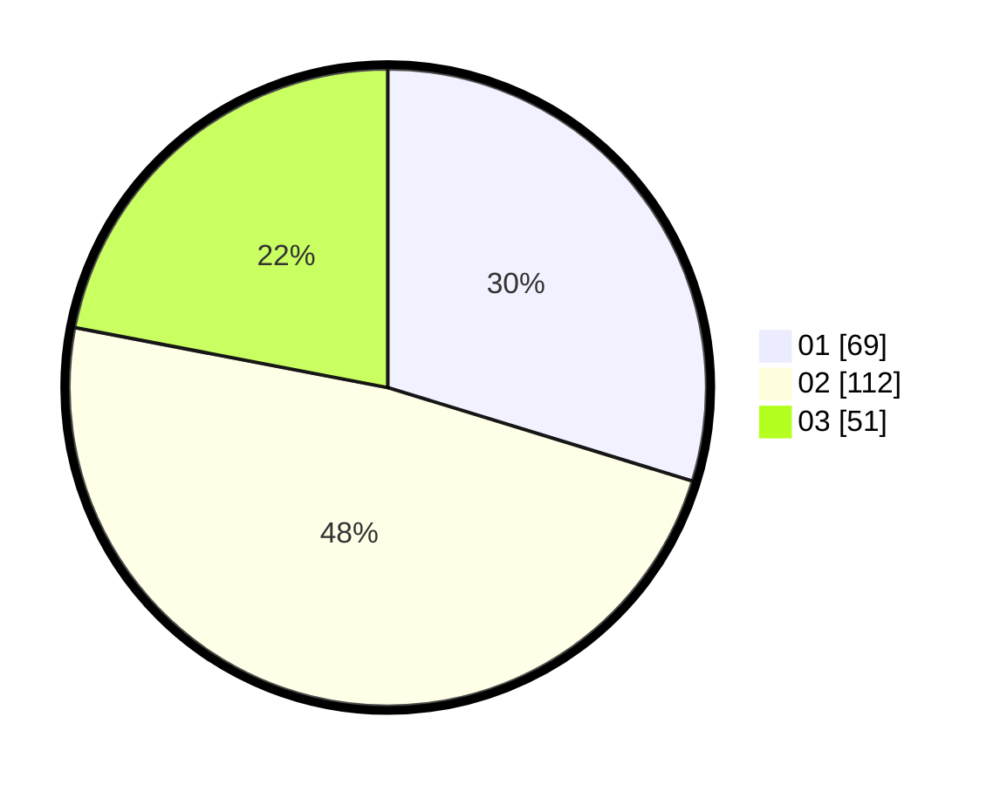

# Hasil

Hasil perolehan suara paslon dapat dilihat pada file paslon-01.txt, paslon-02.txt, dan paslon-03.txt.

Jika tidak ada, artinya data tersebut belum ada pada SIREKAP.

## Perolehan Suara

 * Paslon 01: **69**.
 * Paslon 02: **112**.
 * Paslon 03: **51**.

## Foto C Plano

https://sirekap-obj-formc.kpu.go.id/4ddd/pemilu/ppwp/31/73/05/10/01/3173051001104-20240215-002935--640c0d16-0b6c-4b73-8b4c-19358f971697.jpg

https://sirekap-obj-formc.kpu.go.id/4ddd/pemilu/ppwp/31/73/05/10/01/3173051001104-20240215-002924--c16870ce-f5f8-4d71-a401-7dc7b2e4de50.jpg

https://sirekap-obj-formc.kpu.go.id/4ddd/pemilu/ppwp/31/73/05/10/01/3173051001104-20240215-003052--914c326a-af3d-4fb7-87ce-85882c215562.jpg
