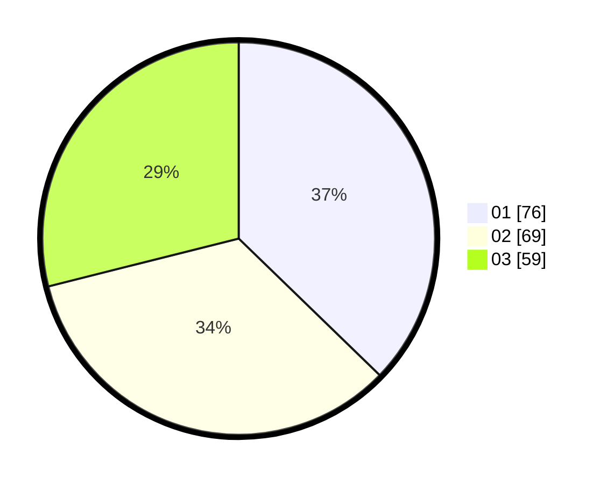

# Hasil

Hasil perolehan suara paslon dapat dilihat pada file paslon-01.txt, paslon-02.txt, dan paslon-03.txt.

Jika tidak ada, artinya data tersebut belum ada pada SIREKAP.

## Perolehan Suara

 * Paslon 01: **76**.
 * Paslon 02: **69**.
 * Paslon 03: **59**.

## Foto C Plano

https://sirekap-obj-formc.kpu.go.id/acd5/pemilu/ppwp/31/73/05/10/01/3173051001106-20240215-003502--c3d858a7-bbe3-41b5-8954-fa2b1d7c601f.jpg

https://sirekap-obj-formc.kpu.go.id/acd5/pemilu/ppwp/31/73/05/10/01/3173051001106-20240215-003600--365ce66d-f872-4061-882e-c13d9694ecda.jpg

https://sirekap-obj-formc.kpu.go.id/acd5/pemilu/ppwp/31/73/05/10/01/3173051001106-20240215-003650--8d681473-834c-4542-81d2-5e4cbc775bef.jpg
