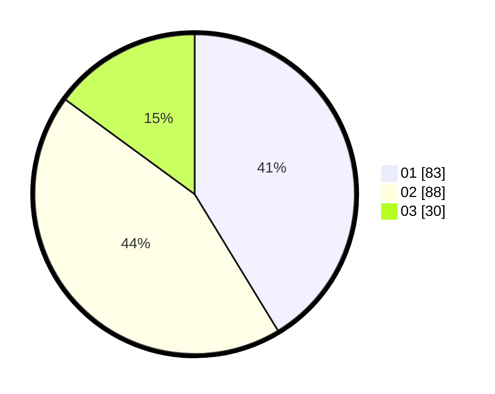

# Hasil

Hasil perolehan suara paslon dapat dilihat pada file paslon-01.txt, paslon-02.txt, dan paslon-03.txt.

Jika tidak ada, artinya data tersebut belum ada pada SIREKAP.

## Perolehan Suara

 * Paslon 01: **83**.
 * Paslon 02: **88**.
 * Paslon 03: **30**.

## Foto C Plano

https://sirekap-obj-formc.kpu.go.id/2e28/pemilu/ppwp/31/73/05/10/01/3173051001109-20240214-203931--8c7d37d4-da62-4ddd-a097-aa26277ab257.jpg

https://sirekap-obj-formc.kpu.go.id/2e28/pemilu/ppwp/31/73/05/10/01/3173051001109-20240214-213729--a38f95a4-0557-499d-b94b-4809d9f00461.jpg
