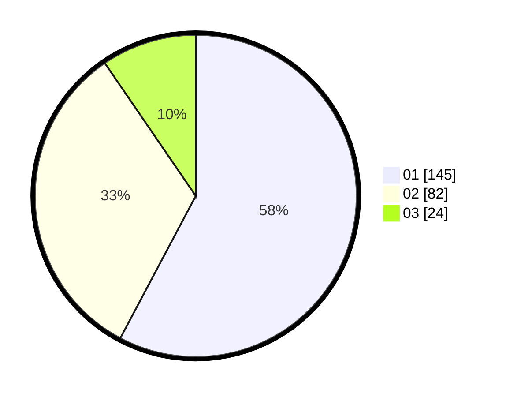

# Hasil

Hasil perolehan suara paslon dapat dilihat pada file paslon-01.txt, paslon-02.txt, dan paslon-03.txt.

Jika tidak ada, artinya data tersebut belum ada pada SIREKAP.

## Perolehan Suara

 * Paslon 01: **145**.
 * Paslon 02: **82**.
 * Paslon 03: **24**.

## Foto C Plano

https://sirekap-obj-formc.kpu.go.id/631b/pemilu/ppwp/31/73/05/10/01/3173051001110-20240215-024849--25f72748-63eb-41c3-983b-1c0e6338a96f.jpg

https://sirekap-obj-formc.kpu.go.id/631b/pemilu/ppwp/31/73/05/10/01/3173051001110-20240215-025407--4ae45b3d-1f79-4926-bd4e-feb47660317d.jpg

https://sirekap-obj-formc.kpu.go.id/631b/pemilu/ppwp/31/73/05/10/01/3173051001110-20240215-025606--bfa88adc-15dd-42ef-a684-0fee8ecc726d.jpg
