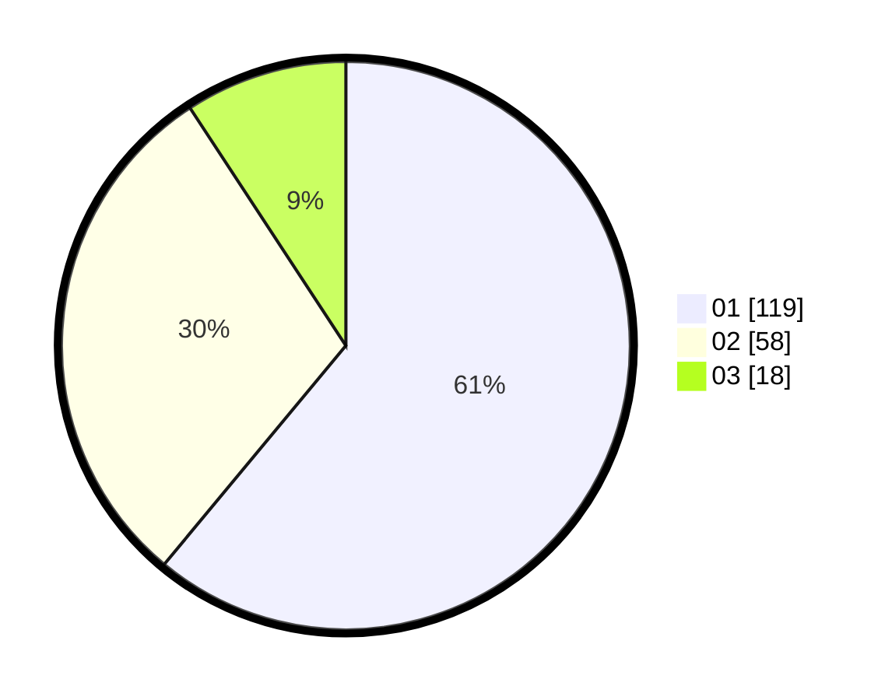

# Hasil

Hasil perolehan suara paslon dapat dilihat pada file paslon-01.txt, paslon-02.txt, dan paslon-03.txt.

Jika tidak ada, artinya data tersebut belum ada pada SIREKAP.

## Perolehan Suara

 * Paslon 01: **119**.
 * Paslon 02: **58**.
 * Paslon 03: **18**.

## Foto C Plano

https://sirekap-obj-formc.kpu.go.id/896d/pemilu/ppwp/31/73/05/10/01/3173051001112-20240215-014405--5da5325a-70fa-484c-90b1-f7d2d24551b2.jpg

https://sirekap-obj-formc.kpu.go.id/896d/pemilu/ppwp/31/73/05/10/01/3173051001112-20240215-014437--da526ba3-b6ab-4058-a13e-a2565e4c6618.jpg

https://sirekap-obj-formc.kpu.go.id/896d/pemilu/ppwp/31/73/05/10/01/3173051001112-20240215-014510--edaad184-c854-475d-9d3a-b35b29064fe7.jpg
