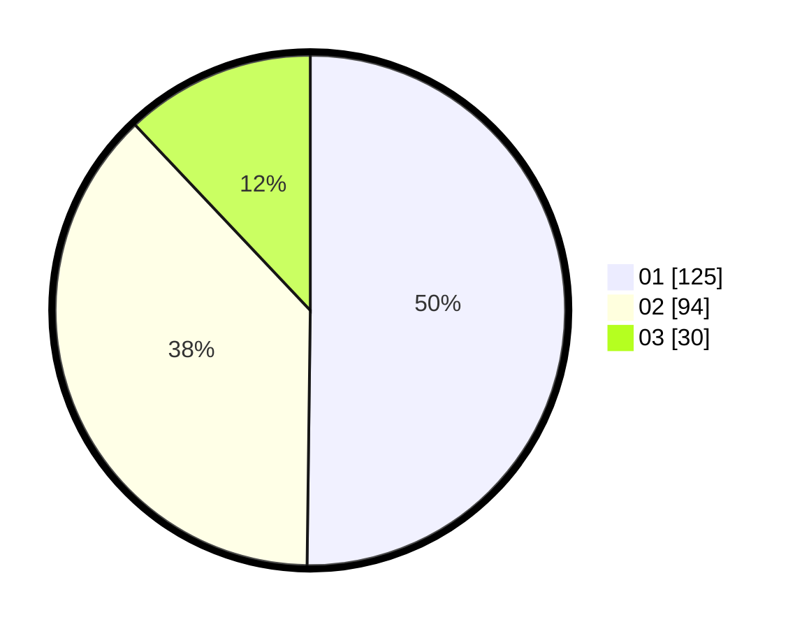

# Hasil

Hasil perolehan suara paslon dapat dilihat pada file paslon-01.txt, paslon-02.txt, dan paslon-03.txt.

Jika tidak ada, artinya data tersebut belum ada pada SIREKAP.

## Perolehan Suara

 * Paslon 01: **125**.
 * Paslon 02: **94**.
 * Paslon 03: **30**.

## Foto C Plano

https://sirekap-obj-formc.kpu.go.id/34a8/pemilu/ppwp/31/73/05/10/01/3173051001120-20240214-230206--86ae69d5-3b60-4dfa-8553-eb8b28cd1f9b.jpg

https://sirekap-obj-formc.kpu.go.id/34a8/pemilu/ppwp/31/73/05/10/01/3173051001120-20240214-230358--1053c51d-a7f4-43f9-bf94-c657a97a7a57.jpg

https://sirekap-obj-formc.kpu.go.id/34a8/pemilu/ppwp/31/73/05/10/01/3173051001120-20240214-230605--ddf1711f-05ae-4130-a39f-7fa5a66429fd.jpg
