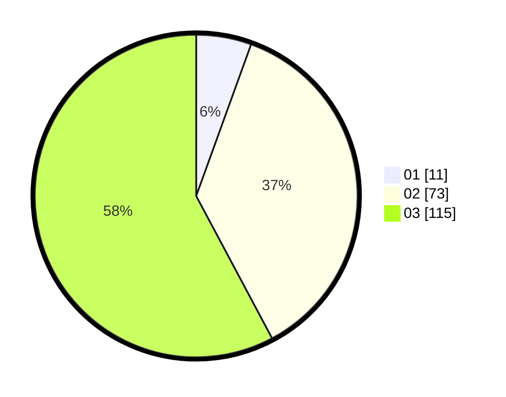

# Hasil

Hasil perolehan suara paslon dapat dilihat pada file paslon-01.txt, paslon-02.txt, dan paslon-03.txt.

Jika tidak ada, artinya data tersebut belum ada pada SIREKAP.

## Perolehan Suara

 * Paslon 01: **11**.
 * Paslon 02: **73**.
 * Paslon 03: **115**.

## Foto C Plano

https://sirekap-obj-formc.kpu.go.id/4e42/pemilu/ppwp/31/73/05/10/01/3173051001124-20240216-121639--87c883c6-c551-476f-9e9b-76e01b7fafd2.jpg

https://sirekap-obj-formc.kpu.go.id/4e42/pemilu/ppwp/31/73/05/10/01/3173051001124-20240216-121645--8cd96139-ff8a-4bd2-b13c-80778e9752c7.jpg

https://sirekap-obj-formc.kpu.go.id/4e42/pemilu/ppwp/31/73/05/10/01/3173051001124-20240216-121641--eb4a8124-b987-4840-8402-0a63393834b4.jpg

## DATA PEMILIH TETAP

Jumlah pemilih dalam DPT: **223**.
 * L: **111**.
 * P: **112**.

## DATA PENGGUNA HAK PILIH

Jumlah pengguna hak pilih dalam DPT: **187**.
 * L: **93**.
 * P: **94**.

Jumlah pengguna hak pilih dalam DPTb: **12**.
 * L: **4**.
 * P: **8**.

Jumlah pengguna hak pilih dalam DPK: **1**.
 * L: **1**.
 * P: **0**.

Jumlah pengguna hak pilih: **200**.
 * L: **98**.
 * P: **102**.

## JUMLAH SUARA SAH DAN TIDAK SAH

JUMLAH SELURUH SUARA SAH: **199**.

JUMLAH SUARA TIDAK SAH: **1**.

JUMLAH SELURUH SUARA SAH DAN SUARA TIDAK SAH: **200**.
