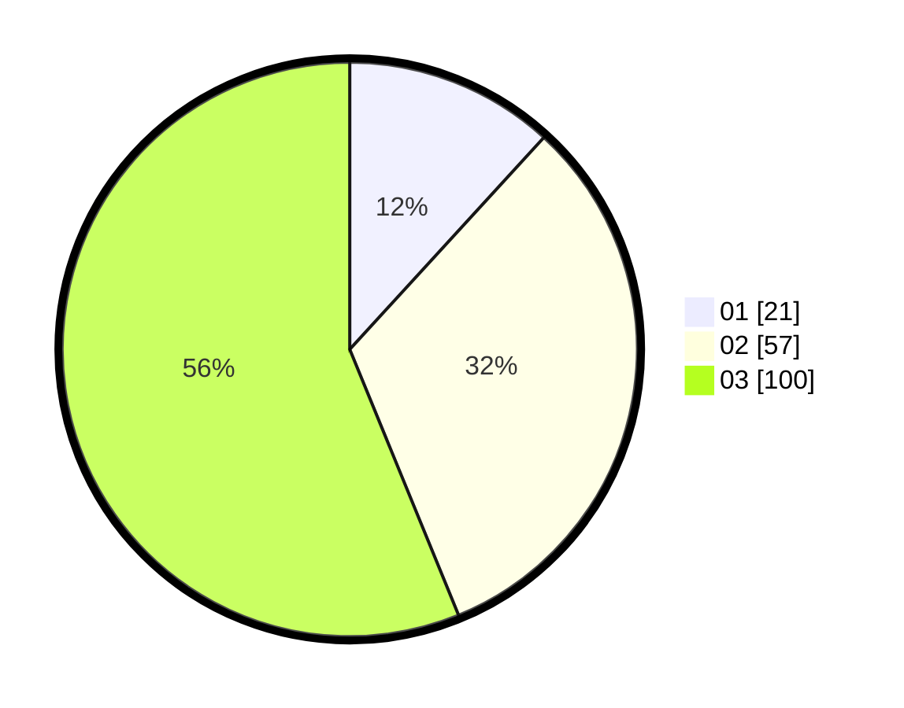

# Hasil

Hasil perolehan suara paslon dapat dilihat pada file paslon-01.txt, paslon-02.txt, dan paslon-03.txt.

Jika tidak ada, artinya data tersebut belum ada pada SIREKAP.

## Perolehan Suara

 * Paslon 01: **21**.
 * Paslon 02: **57**.
 * Paslon 03: **100**.

## Foto C Plano

https://sirekap-obj-formc.kpu.go.id/07f8/pemilu/ppwp/31/73/05/10/01/3173051001125-20240215-221040--f0cd4242-554b-411d-8aab-3d124d9557e5.jpg

https://sirekap-obj-formc.kpu.go.id/07f8/pemilu/ppwp/31/73/05/10/01/3173051001125-20240215-221042--5d13ee27-0337-46fa-aa7f-cfd83239caf0.jpg

https://sirekap-obj-formc.kpu.go.id/07f8/pemilu/ppwp/31/73/05/10/01/3173051001125-20240215-221041--595be1d7-a0af-4643-8e08-890cd61b3a67.jpg

## DATA PEMILIH TETAP

Jumlah pemilih dalam DPT: **220**.
 * L: **107**.
 * P: **113**.

## DATA PENGGUNA HAK PILIH

Jumlah pengguna hak pilih dalam DPT: **163**.
 * L: **82**.
 * P: **81**.

Jumlah pengguna hak pilih dalam DPTb: **14**.
 * L: **4**.
 * P: **10**.

Jumlah pengguna hak pilih dalam DPK: **2**.
 * L: **2**.
 * P: **0**.

Jumlah pengguna hak pilih: **179**.
 * L: **88**.
 * P: **91**.

## JUMLAH SUARA SAH DAN TIDAK SAH

JUMLAH SELURUH SUARA SAH: **178**.

JUMLAH SUARA TIDAK SAH: **1**.

JUMLAH SELURUH SUARA SAH DAN SUARA TIDAK SAH: **179**.
