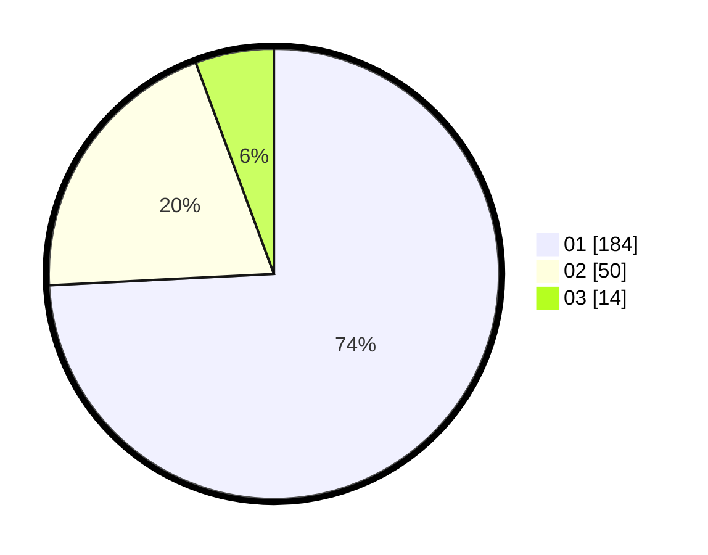

# Hasil

Hasil perolehan suara paslon dapat dilihat pada file paslon-01.txt, paslon-02.txt, dan paslon-03.txt.

Jika tidak ada, artinya data tersebut belum ada pada SIREKAP.

## Perolehan Suara

 * Paslon 01: **184**.
 * Paslon 02: **50**.
 * Paslon 03: **14**.

## Foto C Plano

https://sirekap-obj-formc.kpu.go.id/17e7/pemilu/ppwp/31/73/05/10/01/3173051001133-20240214-155423--db19478d-a8a1-4b9a-a559-dd582f13a225.jpg

https://sirekap-obj-formc.kpu.go.id/17e7/pemilu/ppwp/31/73/05/10/01/3173051001133-20240214-155553--0c78f1f9-c04c-4c1e-9082-2340e88785be.jpg

https://sirekap-obj-formc.kpu.go.id/17e7/pemilu/ppwp/31/73/05/10/01/3173051001133-20240214-155737--c4829446-0338-4620-a442-4afaa0d69c9c.jpg

## DATA PEMILIH TETAP

Jumlah pemilih dalam DPT: **295**.
 * L: **147**.
 * P: **148**.

## DATA PENGGUNA HAK PILIH

Jumlah pengguna hak pilih dalam DPT: **251**.
 * L: **118**.
 * P: **133**.

Jumlah pengguna hak pilih dalam DPTb: **0**.
 * L: **0**.
 * P: **0**.

Jumlah pengguna hak pilih dalam DPK: **0**.
 * L: **0**.
 * P: **0**.

Jumlah pengguna hak pilih: **251**.
 * L: **118**.
 * P: **133**.

## JUMLAH SUARA SAH DAN TIDAK SAH

JUMLAH SELURUH SUARA SAH: **248**.

JUMLAH SUARA TIDAK SAH: **3**.

JUMLAH SELURUH SUARA SAH DAN SUARA TIDAK SAH: **251**.
