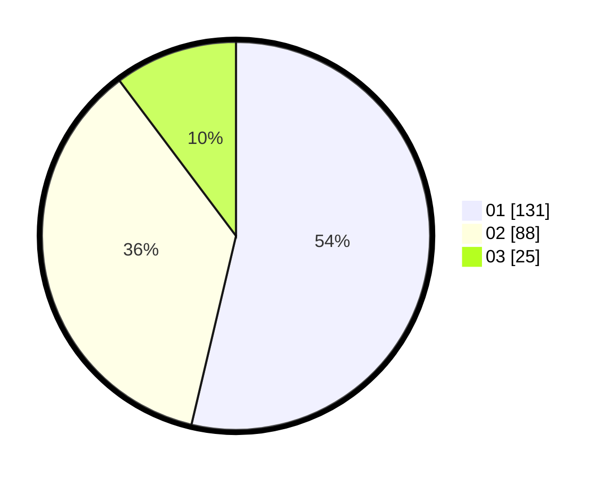

# Hasil

Hasil perolehan suara paslon dapat dilihat pada file paslon-01.txt, paslon-02.txt, dan paslon-03.txt.

Jika tidak ada, artinya data tersebut belum ada pada SIREKAP.

## Perolehan Suara

 * Paslon 01: **131**.
 * Paslon 02: **88**.
 * Paslon 03: **25**.

## Foto C Plano

https://sirekap-obj-formc.kpu.go.id/7c5d/pemilu/ppwp/31/73/05/10/01/3173051001135-20240214-223102--f2ca85c9-2968-4de6-93b6-2b17b12e14dd.jpg

https://sirekap-obj-formc.kpu.go.id/7c5d/pemilu/ppwp/31/73/05/10/01/3173051001135-20240214-215232--c64bd3e2-f7d1-4dda-8eea-0aed4b9946a6.jpg

https://sirekap-obj-formc.kpu.go.id/7c5d/pemilu/ppwp/31/73/05/10/01/3173051001135-20240214-215307--2b56d06b-1557-4707-bc25-2fd68e914e8a.jpg
