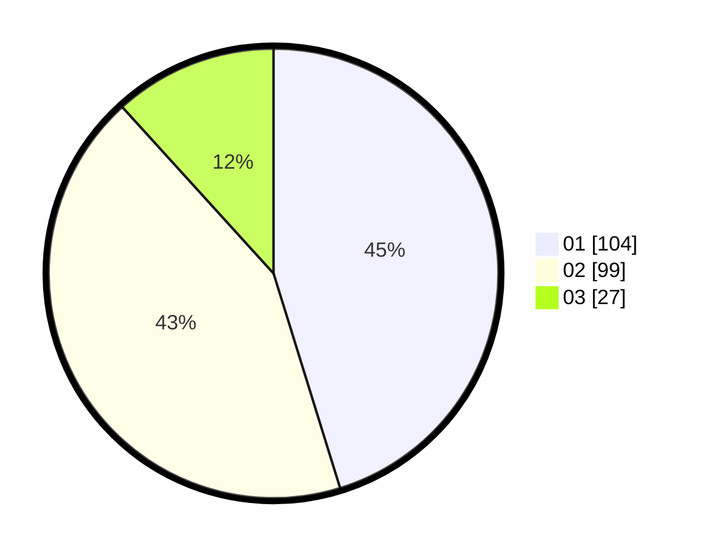

# Hasil

Hasil perolehan suara paslon dapat dilihat pada file paslon-01.txt, paslon-02.txt, dan paslon-03.txt.

Jika tidak ada, artinya data tersebut belum ada pada SIREKAP.

## Perolehan Suara

 * Paslon 01: **104**.
 * Paslon 02: **99**.
 * Paslon 03: **27**.

## Foto C Plano

https://sirekap-obj-formc.kpu.go.id/cb44/pemilu/ppwp/31/73/05/10/01/3173051001137-20240215-030442--e901c62f-4c29-43f0-a1b0-8f9131e05eb6.jpg

https://sirekap-obj-formc.kpu.go.id/cb44/pemilu/ppwp/31/73/05/10/01/3173051001137-20240215-030506--769d4eac-7a16-452a-995a-0baaf57ab606.jpg

https://sirekap-obj-formc.kpu.go.id/cb44/pemilu/ppwp/31/73/05/10/01/3173051001137-20240215-030540--ad8b0514-c8a4-4cd6-a532-27d5a891b944.jpg
