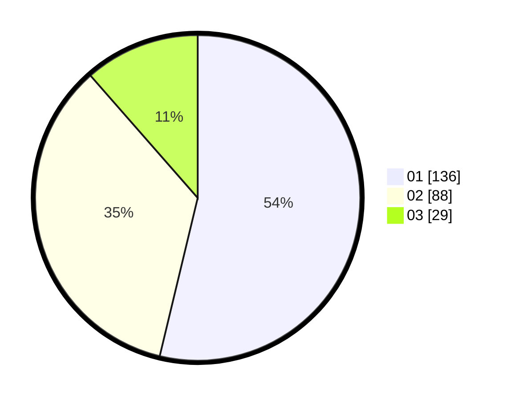

# Hasil

Hasil perolehan suara paslon dapat dilihat pada file paslon-01.txt, paslon-02.txt, dan paslon-03.txt.

Jika tidak ada, artinya data tersebut belum ada pada SIREKAP.

## Perolehan Suara

 * Paslon 01: **136**.
 * Paslon 02: **88**.
 * Paslon 03: **29**.

## Foto C Plano

https://sirekap-obj-formc.kpu.go.id/444f/pemilu/ppwp/31/73/05/10/01/3173051001138-20240214-234948--17c9df69-0708-4c53-a618-e388f70076aa.jpg

https://sirekap-obj-formc.kpu.go.id/444f/pemilu/ppwp/31/73/05/10/01/3173051001138-20240214-235337--836f088a-3a82-42c7-b3ec-4f03696d24ec.jpg

https://sirekap-obj-formc.kpu.go.id/444f/pemilu/ppwp/31/73/05/10/01/3173051001138-20240214-235559--61c1e8eb-e23a-4ea2-bc8a-2ab4fd11995d.jpg
