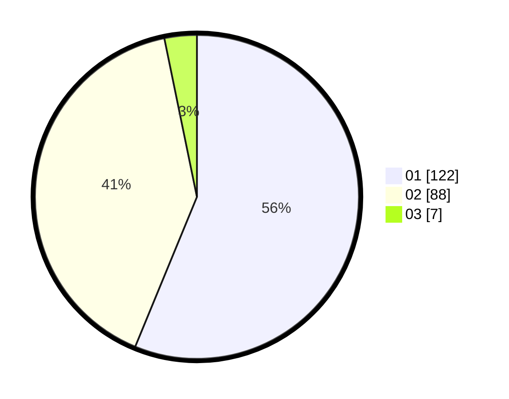

# Hasil

Hasil perolehan suara paslon dapat dilihat pada file paslon-01.txt, paslon-02.txt, dan paslon-03.txt.

Jika tidak ada, artinya data tersebut belum ada pada SIREKAP.

## Perolehan Suara

 * Paslon 01: **122**.
 * Paslon 02: **88**.
 * Paslon 03: **7**.

## Foto C Plano

https://sirekap-obj-formc.kpu.go.id/d796/pemilu/ppwp/31/73/05/10/01/3173051001145-20240214-155256--8e5eb9ca-285e-409d-b379-eb15ec07c119.jpg

https://sirekap-obj-formc.kpu.go.id/d796/pemilu/ppwp/31/73/05/10/01/3173051001145-20240214-213128--abca8d70-78a8-4562-95a6-dd5e8c2d0a63.jpg

https://sirekap-obj-formc.kpu.go.id/d796/pemilu/ppwp/31/73/05/10/01/3173051001145-20240214-213307--91b0ac59-20ed-4c7e-9a27-9ce3a6172ce4.jpg
