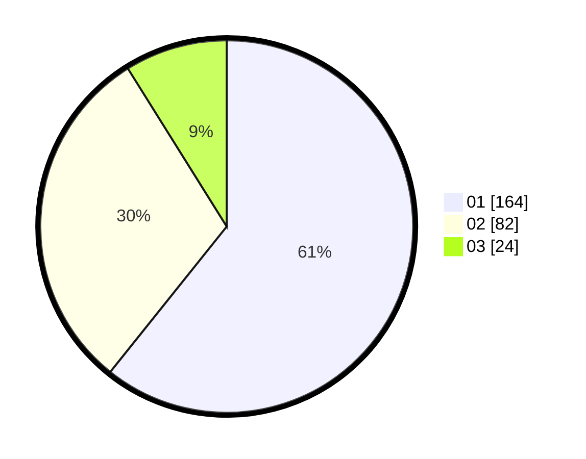

# Hasil

Hasil perolehan suara paslon dapat dilihat pada file paslon-01.txt, paslon-02.txt, dan paslon-03.txt.

Jika tidak ada, artinya data tersebut belum ada pada SIREKAP.

## Perolehan Suara

 * Paslon 01: **164**.
 * Paslon 02: **82**.
 * Paslon 03: **24**.

## Foto C Plano

https://sirekap-obj-formc.kpu.go.id/3844/pemilu/ppwp/31/73/05/10/01/3173051001149-20240214-205847--a43c4d11-9af2-4029-80e9-247cae893b1a.jpg

https://sirekap-obj-formc.kpu.go.id/3844/pemilu/ppwp/31/73/05/10/01/3173051001149-20240214-210004--ec479274-bb4b-43d6-b2b4-4e568b8380f0.jpg

https://sirekap-obj-formc.kpu.go.id/3844/pemilu/ppwp/31/73/05/10/01/3173051001149-20240214-210052--bf8f0159-08ce-4ab3-a8a8-2e48775a1b74.jpg
