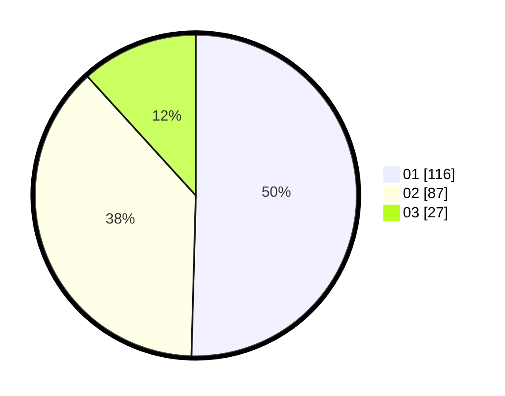

# Hasil

Hasil perolehan suara paslon dapat dilihat pada file paslon-01.txt, paslon-02.txt, dan paslon-03.txt.

Jika tidak ada, artinya data tersebut belum ada pada SIREKAP.

## Perolehan Suara

 * Paslon 01: **116**.
 * Paslon 02: **87**.
 * Paslon 03: **27**.

## Foto C Plano

https://sirekap-obj-formc.kpu.go.id/386c/pemilu/ppwp/31/73/05/10/01/3173051001151-20240214-200333--47b17aa9-752c-4d8f-95ba-a204b48273bd.jpg

https://sirekap-obj-formc.kpu.go.id/386c/pemilu/ppwp/31/73/05/10/01/3173051001151-20240214-201011--469c68c1-bfa0-49ab-8191-c6b642917bcf.jpg

https://sirekap-obj-formc.kpu.go.id/386c/pemilu/ppwp/31/73/05/10/01/3173051001151-20240214-201115--33aa351c-13fe-45d7-bc2f-52508a5d1917.jpg

## DATA PEMILIH TETAP

Jumlah pemilih dalam DPT: **293**.
 * L: **154**.
 * P: **139**.

## DATA PENGGUNA HAK PILIH

Jumlah pengguna hak pilih dalam DPT: **210**.
 * L: **105**.
 * P: **105**.

Jumlah pengguna hak pilih dalam DPTb: **21**.
 * L: **10**.
 * P: **11**.

Jumlah pengguna hak pilih dalam DPK: **4**.
 * L: **2**.
 * P: **2**.

Jumlah pengguna hak pilih: **235**.
 * L: **117**.
 * P: **118**.

## JUMLAH SUARA SAH DAN TIDAK SAH

JUMLAH SELURUH SUARA SAH: **230**.

JUMLAH SUARA TIDAK SAH: **5**.

JUMLAH SELURUH SUARA SAH DAN SUARA TIDAK SAH: **235**.
