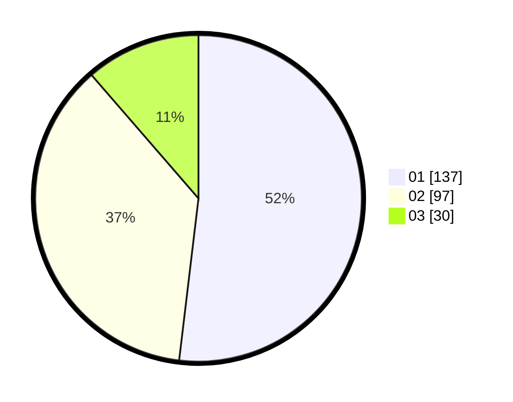

# Hasil

Hasil perolehan suara paslon dapat dilihat pada file paslon-01.txt, paslon-02.txt, dan paslon-03.txt.

Jika tidak ada, artinya data tersebut belum ada pada SIREKAP.

## Perolehan Suara

 * Paslon 01: **137**.
 * Paslon 02: **97**.
 * Paslon 03: **30**.

## Foto C Plano

https://sirekap-obj-formc.kpu.go.id/528f/pemilu/ppwp/31/73/05/10/01/3173051001153-20240215-000011--9772db38-86ad-41aa-9655-1290b7267c3c.jpg

https://sirekap-obj-formc.kpu.go.id/528f/pemilu/ppwp/31/73/05/10/01/3173051001153-20240215-000202--4c2218c4-2a67-44e6-ac23-8bd02fbef983.jpg

https://sirekap-obj-formc.kpu.go.id/528f/pemilu/ppwp/31/73/05/10/01/3173051001153-20240215-000327--0688faec-9c00-4381-a1d0-2067d6d0ced8.jpg
