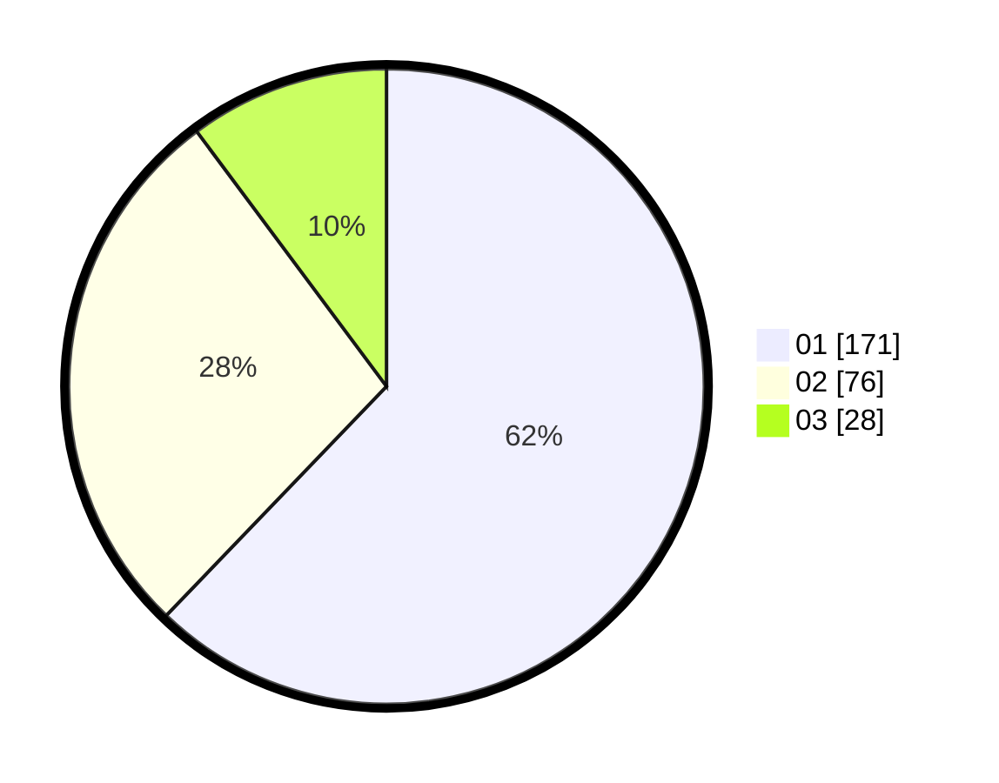

# Hasil

Hasil perolehan suara paslon dapat dilihat pada file paslon-01.txt, paslon-02.txt, dan paslon-03.txt.

Jika tidak ada, artinya data tersebut belum ada pada SIREKAP.

## Perolehan Suara

 * Paslon 01: **171**.
 * Paslon 02: **76**.
 * Paslon 03: **28**.

## Foto C Plano

https://sirekap-obj-formc.kpu.go.id/fa9f/pemilu/ppwp/31/73/05/10/01/3173051001154-20240214-200225--6f02e471-1a14-4fe9-b41a-d4322a828a46.jpg

https://sirekap-obj-formc.kpu.go.id/fa9f/pemilu/ppwp/31/73/05/10/01/3173051001154-20240214-194602--a66a5cca-3f6b-4589-9f19-2b19ff4f9910.jpg

https://sirekap-obj-formc.kpu.go.id/fa9f/pemilu/ppwp/31/73/05/10/01/3173051001154-20240214-194729--8605e5ce-45d1-445d-98d1-42f8195ef9c1.jpg

## DATA PEMILIH TETAP

Jumlah pemilih dalam DPT: **292**.
 * L: **145**.
 * P: **147**.

## DATA PENGGUNA HAK PILIH

Jumlah pengguna hak pilih dalam DPT: **261**.
 * L: **125**.
 * P: **136**.

Jumlah pengguna hak pilih dalam DPTb: **18**.
 * L: **5**.
 * P: **13**.

Jumlah pengguna hak pilih dalam DPK: **2**.
 * L: **0**.
 * P: **2**.

Jumlah pengguna hak pilih: **281**.
 * L: **130**.
 * P: **151**.

## JUMLAH SUARA SAH DAN TIDAK SAH

JUMLAH SELURUH SUARA SAH: **275**.

JUMLAH SUARA TIDAK SAH: **6**.

JUMLAH SELURUH SUARA SAH DAN SUARA TIDAK SAH: **281**.
