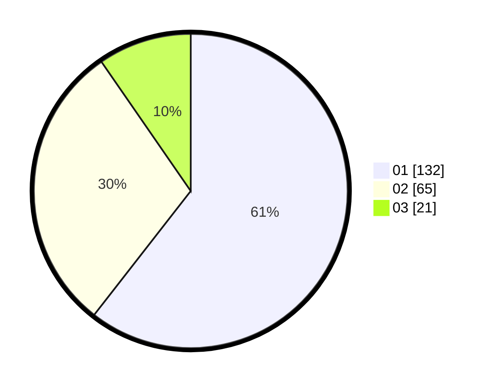

# Hasil

Hasil perolehan suara paslon dapat dilihat pada file paslon-01.txt, paslon-02.txt, dan paslon-03.txt.

Jika tidak ada, artinya data tersebut belum ada pada SIREKAP.

## Perolehan Suara

 * Paslon 01: **132**.
 * Paslon 02: **65**.
 * Paslon 03: **21**.

## Foto C Plano

https://sirekap-obj-formc.kpu.go.id/32a5/pemilu/ppwp/31/73/05/10/01/3173051001157-20240214-215703--a61d6f2a-4c98-46f0-b84f-c293f1fb2619.jpg

https://sirekap-obj-formc.kpu.go.id/32a5/pemilu/ppwp/31/73/05/10/01/3173051001157-20240214-215852--d85eae07-a7c5-4af7-9adf-03e508aed923.jpg

https://sirekap-obj-formc.kpu.go.id/32a5/pemilu/ppwp/31/73/05/10/01/3173051001157-20240214-215925--3ed72043-1deb-4f7c-a191-41ea840674a5.jpg
