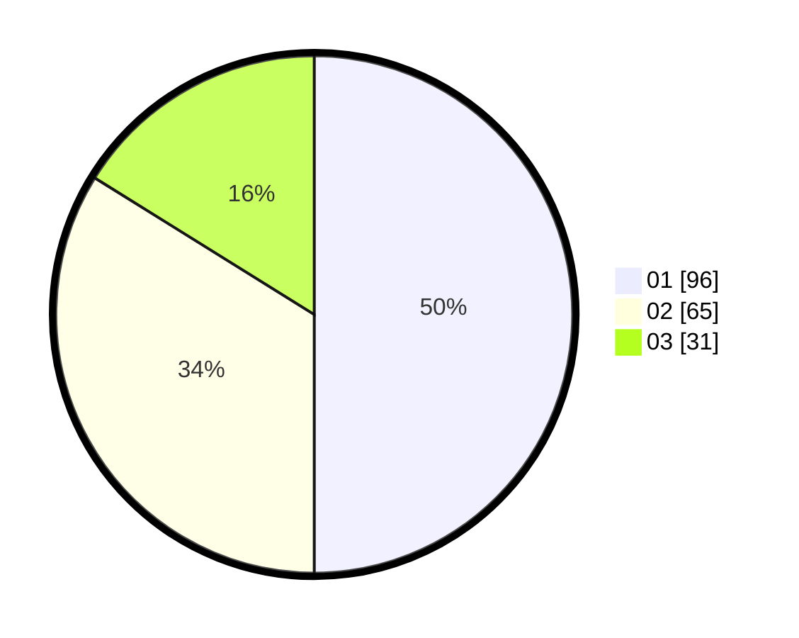

# Hasil

Hasil perolehan suara paslon dapat dilihat pada file paslon-01.txt, paslon-02.txt, dan paslon-03.txt.

Jika tidak ada, artinya data tersebut belum ada pada SIREKAP.

## Perolehan Suara

 * Paslon 01: **96**.
 * Paslon 02: **65**.
 * Paslon 03: **31**.

## Foto C Plano

https://sirekap-obj-formc.kpu.go.id/eb37/pemilu/ppwp/31/73/05/10/01/3173051001158-20240214-211927--2d587d40-b4b6-48ce-be56-dbd6655e1102.jpg

https://sirekap-obj-formc.kpu.go.id/eb37/pemilu/ppwp/31/73/05/10/01/3173051001158-20240214-211941--4fc4f618-dee3-48d4-810d-bfc83452b528.jpg

https://sirekap-obj-formc.kpu.go.id/eb37/pemilu/ppwp/31/73/05/10/01/3173051001158-20240214-211947--2e82a269-24ff-431a-99b8-26895790fffd.jpg
