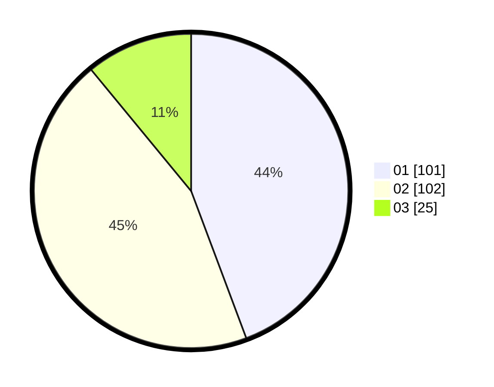

# Hasil

Hasil perolehan suara paslon dapat dilihat pada file paslon-01.txt, paslon-02.txt, dan paslon-03.txt.

Jika tidak ada, artinya data tersebut belum ada pada SIREKAP.

## Perolehan Suara

 * Paslon 01: **101**.
 * Paslon 02: **102**.
 * Paslon 03: **25**.

## Foto C Plano

https://sirekap-obj-formc.kpu.go.id/f5a3/pemilu/ppwp/31/73/05/10/01/3173051001170-20240214-225823--6c5b1bcf-72d3-4cbc-b87d-c3d136c44869.jpg

https://sirekap-obj-formc.kpu.go.id/f5a3/pemilu/ppwp/31/73/05/10/01/3173051001170-20240214-230215--3f151318-a21b-4c2e-9958-a90d2c1b288d.jpg

https://sirekap-obj-formc.kpu.go.id/f5a3/pemilu/ppwp/31/73/05/10/01/3173051001170-20240214-230358--faccc970-721c-4d24-99c5-1207ac3ce38b.jpg
