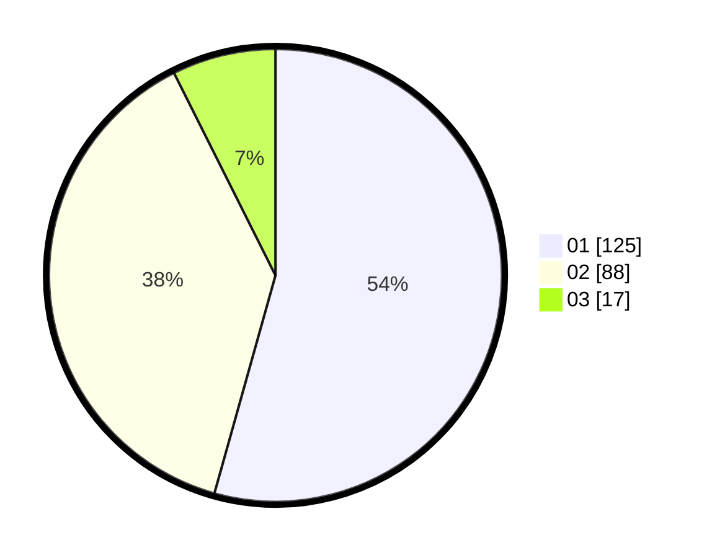

# Hasil

Hasil perolehan suara paslon dapat dilihat pada file paslon-01.txt, paslon-02.txt, dan paslon-03.txt.

Jika tidak ada, artinya data tersebut belum ada pada SIREKAP.

## Perolehan Suara

 * Paslon 01: **125**.
 * Paslon 02: **88**.
 * Paslon 03: **17**.

## Foto C Plano

https://sirekap-obj-formc.kpu.go.id/eeaf/pemilu/ppwp/31/73/05/10/01/3173051001172-20240214-205055--4f77d9cd-f0bd-4dfe-b7e5-97264ace7b02.jpg

https://sirekap-obj-formc.kpu.go.id/eeaf/pemilu/ppwp/31/73/05/10/01/3173051001172-20240214-205325--6e2bd89b-6e52-48be-a2ff-22b38f9aeee8.jpg

https://sirekap-obj-formc.kpu.go.id/eeaf/pemilu/ppwp/31/73/05/10/01/3173051001172-20240214-225954--abb2784b-5120-4651-8baa-b913e4f45409.jpg
