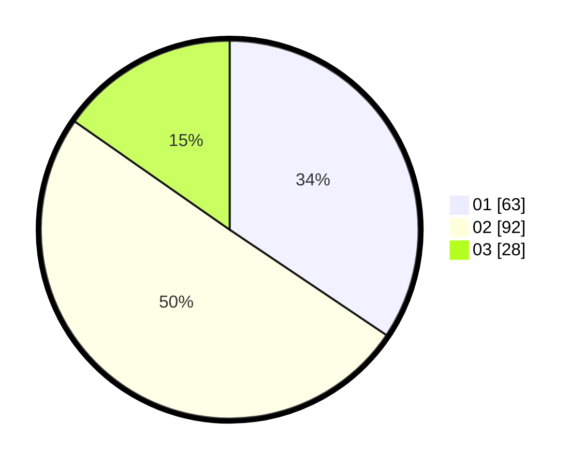

# Hasil

Hasil perolehan suara paslon dapat dilihat pada file paslon-01.txt, paslon-02.txt, dan paslon-03.txt.

Jika tidak ada, artinya data tersebut belum ada pada SIREKAP.

## Perolehan Suara

 * Paslon 01: **63**.
 * Paslon 02: **92**.
 * Paslon 03: **28**.

## Foto C Plano

https://sirekap-obj-formc.kpu.go.id/ffbb/pemilu/ppwp/31/73/05/10/01/3173051001175-20240214-230630--ac7dcad9-4989-4aa4-8b7c-ba32e462d5ab.jpg

https://sirekap-obj-formc.kpu.go.id/ffbb/pemilu/ppwp/31/73/05/10/01/3173051001175-20240214-230305--9e716d06-3ed8-455f-a0f0-59275d6b6544.jpg

https://sirekap-obj-formc.kpu.go.id/ffbb/pemilu/ppwp/31/73/05/10/01/3173051001175-20240214-230420--c93c8fbe-d6df-4b87-bddb-21e95f881850.jpg

## DATA PEMILIH TETAP

Jumlah pemilih dalam DPT: **242**.
 * L: **121**.
 * P: **121**.

## DATA PENGGUNA HAK PILIH

Jumlah pengguna hak pilih dalam DPT: **177**.
 * L: **89**.
 * P: **88**.

Jumlah pengguna hak pilih dalam DPTb: **7**.
 * L: **4**.
 * P: **3**.

Jumlah pengguna hak pilih dalam DPK: **3**.
 * L: **1**.
 * P: **2**.

Jumlah pengguna hak pilih: **187**.
 * L: **93**.
 * P: **94**.

## JUMLAH SUARA SAH DAN TIDAK SAH

JUMLAH SELURUH SUARA SAH: **183**.

JUMLAH SUARA TIDAK SAH: **4**.

JUMLAH SELURUH SUARA SAH DAN SUARA TIDAK SAH: **187**.
