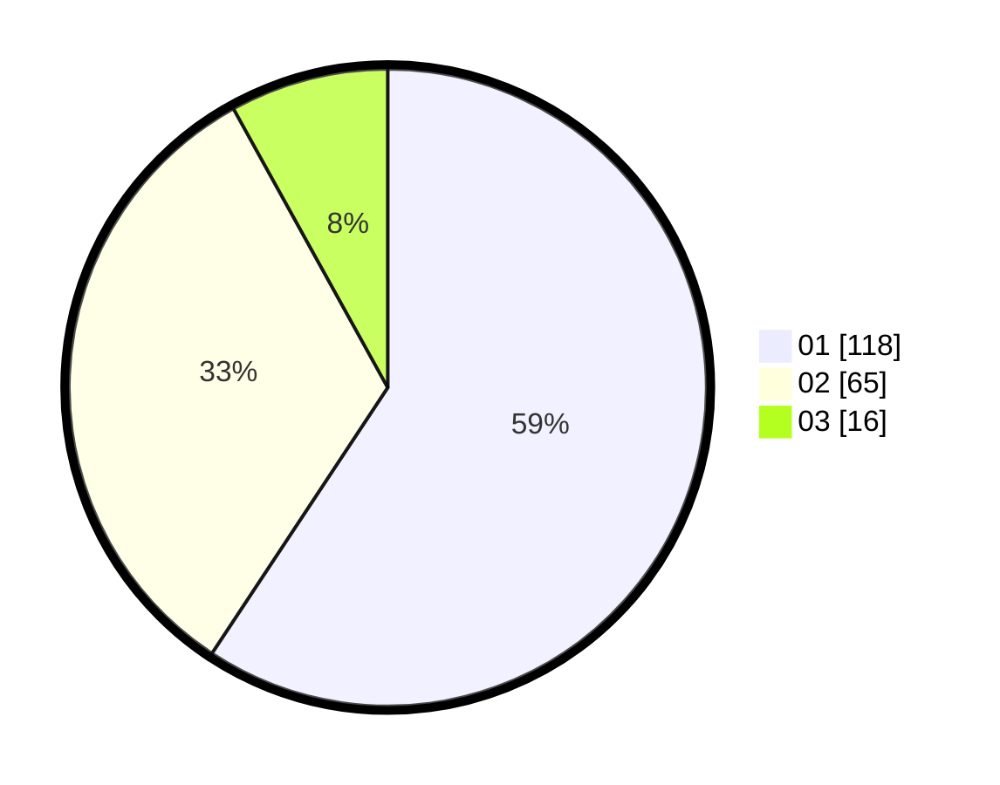

# Hasil

Hasil perolehan suara paslon dapat dilihat pada file paslon-01.txt, paslon-02.txt, dan paslon-03.txt.

Jika tidak ada, artinya data tersebut belum ada pada SIREKAP.

## Perolehan Suara

 * Paslon 01: **118**.
 * Paslon 02: **65**.
 * Paslon 03: **16**.

## Foto C Plano

https://sirekap-obj-formc.kpu.go.id/4d1a/pemilu/ppwp/31/73/05/10/01/3173051001187-20240214-155026--23375a2a-f6bd-4631-9ed0-27b842730eb0.jpg

https://sirekap-obj-formc.kpu.go.id/4d1a/pemilu/ppwp/31/73/05/10/01/3173051001187-20240214-155133--0f7abb39-ecf5-419c-b647-de2761f3f5c8.jpg

https://sirekap-obj-formc.kpu.go.id/4d1a/pemilu/ppwp/31/73/05/10/01/3173051001187-20240214-155245--c33ef767-5e45-44bd-8674-aab62ca95fe7.jpg

## DATA PEMILIH TETAP

Jumlah pemilih dalam DPT: **246**.
 * L: **113**.
 * P: **133**.

## DATA PENGGUNA HAK PILIH

Jumlah pengguna hak pilih dalam DPT: **197**.
 * L: **89**.
 * P: **108**.

Jumlah pengguna hak pilih dalam DPTb: **3**.
 * L: **2**.
 * P: **1**.

Jumlah pengguna hak pilih dalam DPK: **0**.
 * L: **0**.
 * P: **0**.

Jumlah pengguna hak pilih: **200**.
 * L: **91**.
 * P: **109**.

## JUMLAH SUARA SAH DAN TIDAK SAH

JUMLAH SELURUH SUARA SAH: **199**.

JUMLAH SUARA TIDAK SAH: **1**.

JUMLAH SELURUH SUARA SAH DAN SUARA TIDAK SAH: **200**.
