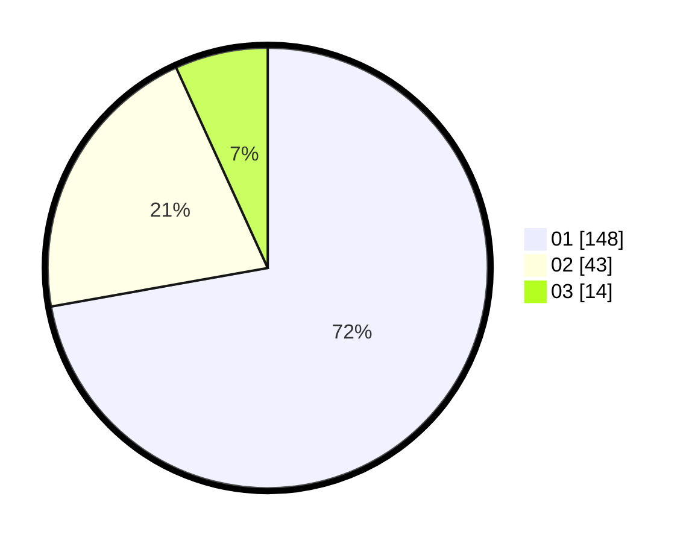

# Hasil

Hasil perolehan suara paslon dapat dilihat pada file paslon-01.txt, paslon-02.txt, dan paslon-03.txt.

Jika tidak ada, artinya data tersebut belum ada pada SIREKAP.

## Perolehan Suara

 * Paslon 01: **148**.
 * Paslon 02: **43**.
 * Paslon 03: **14**.

## Foto C Plano

https://sirekap-obj-formc.kpu.go.id/58a6/pemilu/ppwp/31/73/05/10/02/3173051002009-20240215-035032--ffd5f94a-1dad-4ccd-bf20-bb0a54cf0f1c.jpg

https://sirekap-obj-formc.kpu.go.id/58a6/pemilu/ppwp/31/73/05/10/02/3173051002009-20240215-035126--b7383e07-8ff1-4c29-ba45-cebd06a825a6.jpg

https://sirekap-obj-formc.kpu.go.id/58a6/pemilu/ppwp/31/73/05/10/02/3173051002009-20240215-035238--6dcdb11e-9a71-487b-ae77-75c18d69b109.jpg

## DATA PEMILIH TETAP

Jumlah pemilih dalam DPT: **239**.
 * L: **122**.
 * P: **117**.

## DATA PENGGUNA HAK PILIH

Jumlah pengguna hak pilih dalam DPT: **205**.
 * L: **101**.
 * P: **104**.

Jumlah pengguna hak pilih dalam DPTb: **0**.
 * L: **0**.
 * P: **0**.

Jumlah pengguna hak pilih dalam DPK: **2**.
 * L: **1**.
 * P: **1**.

Jumlah pengguna hak pilih: **207**.
 * L: **102**.
 * P: **105**.

## JUMLAH SUARA SAH DAN TIDAK SAH

JUMLAH SELURUH SUARA SAH: **205**.

JUMLAH SUARA TIDAK SAH: **2**.

JUMLAH SELURUH SUARA SAH DAN SUARA TIDAK SAH: **207**.
