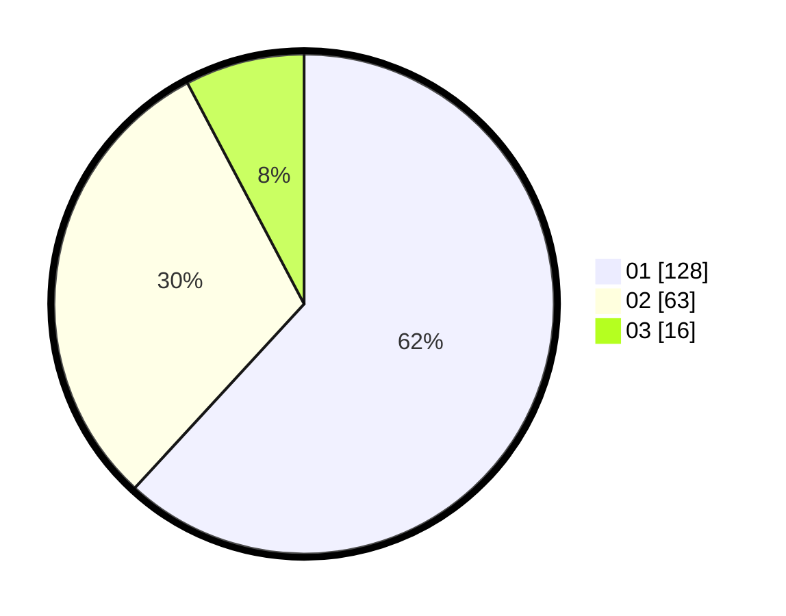

# Hasil

Hasil perolehan suara paslon dapat dilihat pada file paslon-01.txt, paslon-02.txt, dan paslon-03.txt.

Jika tidak ada, artinya data tersebut belum ada pada SIREKAP.

## Perolehan Suara

 * Paslon 01: **128**.
 * Paslon 02: **63**.
 * Paslon 03: **16**.

## Foto C Plano

https://sirekap-obj-formc.kpu.go.id/8f51/pemilu/ppwp/31/73/05/10/02/3173051002011-20240216-045605--5d26bf51-3b0f-440b-beed-903b3c5a1ed7.jpg

https://sirekap-obj-formc.kpu.go.id/8f51/pemilu/ppwp/31/73/05/10/02/3173051002011-20240216-045607--037d5c53-4003-4fe5-989e-b137c1633eb3.jpg

https://sirekap-obj-formc.kpu.go.id/8f51/pemilu/ppwp/31/73/05/10/02/3173051002011-20240216-045606--dee34bd5-30ce-4aee-a376-ef895f042445.jpg

## DATA PEMILIH TETAP

Jumlah pemilih dalam DPT: **278**.
 * L: **148**.
 * P: **130**.

## DATA PENGGUNA HAK PILIH

Jumlah pengguna hak pilih dalam DPT: **204**.
 * L: **104**.
 * P: **100**.

Jumlah pengguna hak pilih dalam DPTb: **2**.
 * L: **1**.
 * P: **1**.

Jumlah pengguna hak pilih dalam DPK: **2**.
 * L: **1**.
 * P: **1**.

Jumlah pengguna hak pilih: **208**.
 * L: **106**.
 * P: **102**.

## JUMLAH SUARA SAH DAN TIDAK SAH

JUMLAH SELURUH SUARA SAH: **207**.

JUMLAH SUARA TIDAK SAH: **1**.

JUMLAH SELURUH SUARA SAH DAN SUARA TIDAK SAH: **208**.
