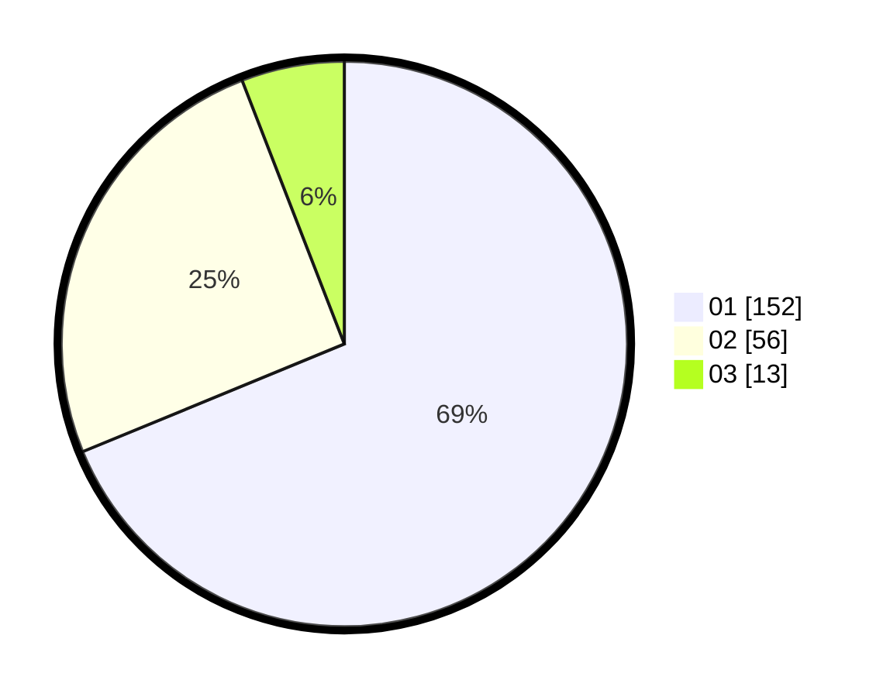

# Hasil

Hasil perolehan suara paslon dapat dilihat pada file paslon-01.txt, paslon-02.txt, dan paslon-03.txt.

Jika tidak ada, artinya data tersebut belum ada pada SIREKAP.

## Perolehan Suara

 * Paslon 01: **152**.
 * Paslon 02: **56**.
 * Paslon 03: **13**.

## Foto C Plano

https://sirekap-obj-formc.kpu.go.id/77e2/pemilu/ppwp/31/73/05/10/02/3173051002016-20240214-210802--60bceae1-bd29-4284-ba55-8754e9e8f41e.jpg

https://sirekap-obj-formc.kpu.go.id/77e2/pemilu/ppwp/31/73/05/10/02/3173051002016-20240214-211328--a12579f2-63c4-46d4-af8a-4d76a613ed18.jpg

https://sirekap-obj-formc.kpu.go.id/77e2/pemilu/ppwp/31/73/05/10/02/3173051002016-20240214-212709--248223b4-1743-4171-9017-f130a973ea53.jpg

## DATA PEMILIH TETAP

Jumlah pemilih dalam DPT: **279**.
 * L: **142**.
 * P: **137**.

## DATA PENGGUNA HAK PILIH

Jumlah pengguna hak pilih dalam DPT: **217**.
 * L: **107**.
 * P: **110**.

Jumlah pengguna hak pilih dalam DPTb: **4**.
 * L: **1**.
 * P: **3**.

Jumlah pengguna hak pilih dalam DPK: **3**.
 * L: **1**.
 * P: **2**.

Jumlah pengguna hak pilih: **224**.
 * L: **109**.
 * P: **115**.

## JUMLAH SUARA SAH DAN TIDAK SAH

JUMLAH SELURUH SUARA SAH: **221**.

JUMLAH SUARA TIDAK SAH: **4**.

JUMLAH SELURUH SUARA SAH DAN SUARA TIDAK SAH: **225**.
