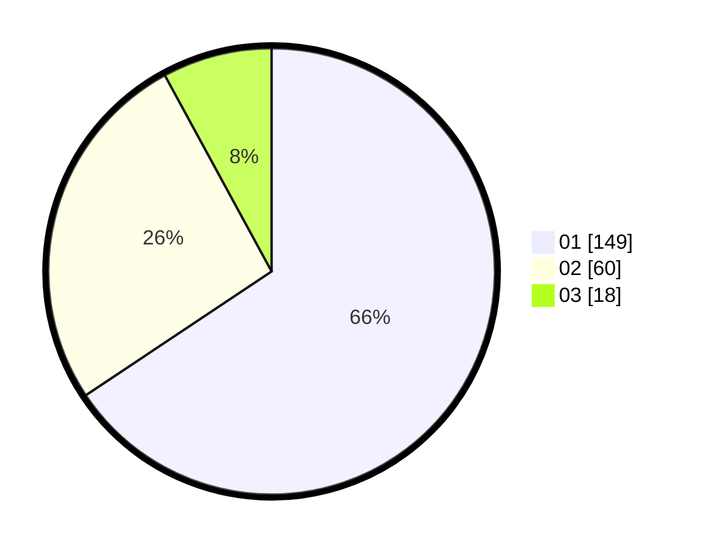

# Hasil

Hasil perolehan suara paslon dapat dilihat pada file paslon-01.txt, paslon-02.txt, dan paslon-03.txt.

Jika tidak ada, artinya data tersebut belum ada pada SIREKAP.

## Perolehan Suara

 * Paslon 01: **149**.
 * Paslon 02: **60**.
 * Paslon 03: **18**.

## Foto C Plano

https://sirekap-obj-formc.kpu.go.id/a5cb/pemilu/ppwp/31/73/05/10/02/3173051002036-20240216-121642--934dbd64-ba4f-4a42-9be7-b91212eb6c3e.jpg

https://sirekap-obj-formc.kpu.go.id/a5cb/pemilu/ppwp/31/73/05/10/02/3173051002036-20240216-121657--b1190a07-53c8-453c-803c-b34c8d1eb4e7.jpg

https://sirekap-obj-formc.kpu.go.id/a5cb/pemilu/ppwp/31/73/05/10/02/3173051002036-20240216-121651--697d2680-fe54-4244-b6c6-f7e9c962bdbf.jpg

## DATA PEMILIH TETAP

Jumlah pemilih dalam DPT: **276**.
 * L: **142**.
 * P: **134**.

## DATA PENGGUNA HAK PILIH

Jumlah pengguna hak pilih dalam DPT: **227**.
 * L: **114**.
 * P: **113**.

Jumlah pengguna hak pilih dalam DPTb: **4**.
 * L: **1**.
 * P: **3**.

Jumlah pengguna hak pilih dalam DPK: **1**.
 * L: **0**.
 * P: **1**.

Jumlah pengguna hak pilih: **232**.
 * L: **115**.
 * P: **117**.

## JUMLAH SUARA SAH DAN TIDAK SAH

JUMLAH SELURUH SUARA SAH: **227**.

JUMLAH SUARA TIDAK SAH: **5**.

JUMLAH SELURUH SUARA SAH DAN SUARA TIDAK SAH: **232**.
