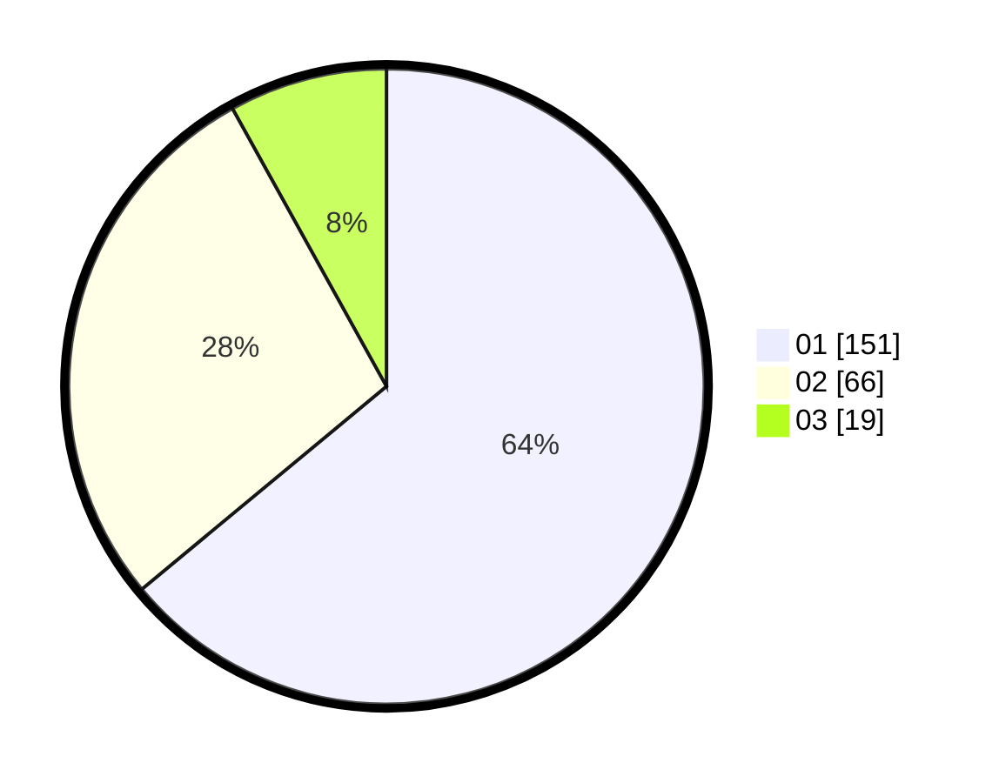

# Hasil

Hasil perolehan suara paslon dapat dilihat pada file paslon-01.txt, paslon-02.txt, dan paslon-03.txt.

Jika tidak ada, artinya data tersebut belum ada pada SIREKAP.

## Perolehan Suara

 * Paslon 01: **151**.
 * Paslon 02: **66**.
 * Paslon 03: **19**.

## Foto C Plano

https://sirekap-obj-formc.kpu.go.id/d0fd/pemilu/ppwp/31/73/05/10/02/3173051002037-20240215-233509--90177b68-15e5-4750-973f-ade7d94b63e5.jpg

https://sirekap-obj-formc.kpu.go.id/d0fd/pemilu/ppwp/31/73/05/10/02/3173051002037-20240216-175743--3e11add2-96bf-4a27-972f-821797fca412.jpg

https://sirekap-obj-formc.kpu.go.id/d0fd/pemilu/ppwp/31/73/05/10/02/3173051002037-20240216-175743--afd40fd5-e0f0-4ca0-a887-47d0e2b86642.jpg

## DATA PEMILIH TETAP

Jumlah pemilih dalam DPT: **280**.
 * L: **143**.
 * P: **137**.

## DATA PENGGUNA HAK PILIH

Jumlah pengguna hak pilih dalam DPT: **236**.
 * L: **128**.
 * P: **108**.

Jumlah pengguna hak pilih dalam DPTb: **1**.
 * L: **0**.
 * P: **1**.

Jumlah pengguna hak pilih dalam DPK: **1**.
 * L: **1**.
 * P: **0**.

Jumlah pengguna hak pilih: **238**.
 * L: **129**.
 * P: **109**.

## JUMLAH SUARA SAH DAN TIDAK SAH

JUMLAH SELURUH SUARA SAH: **236**.

JUMLAH SUARA TIDAK SAH: **2**.

JUMLAH SELURUH SUARA SAH DAN SUARA TIDAK SAH: **238**.
