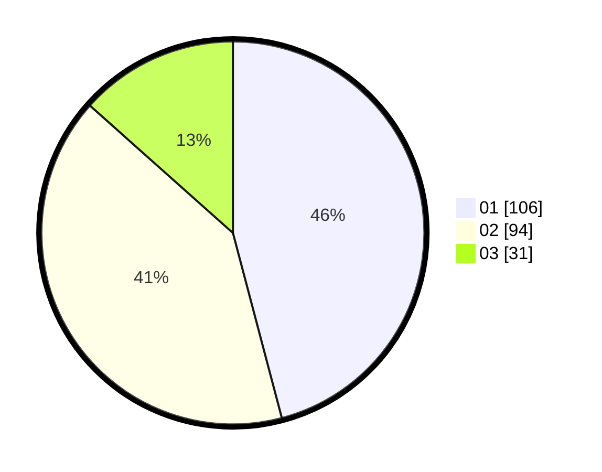

# Hasil

Hasil perolehan suara paslon dapat dilihat pada file paslon-01.txt, paslon-02.txt, dan paslon-03.txt.

Jika tidak ada, artinya data tersebut belum ada pada SIREKAP.

## Perolehan Suara

 * Paslon 01: **106**.
 * Paslon 02: **94**.
 * Paslon 03: **31**.

## Foto C Plano

https://sirekap-obj-formc.kpu.go.id/643c/pemilu/ppwp/31/73/05/10/02/3173051002038-20240214-202927--1c56bac5-01b8-406b-999c-37f6d71878eb.jpg

https://sirekap-obj-formc.kpu.go.id/643c/pemilu/ppwp/31/73/05/10/02/3173051002038-20240214-202959--fa744207-d9a1-4a18-a434-8ce15dab7eee.jpg
