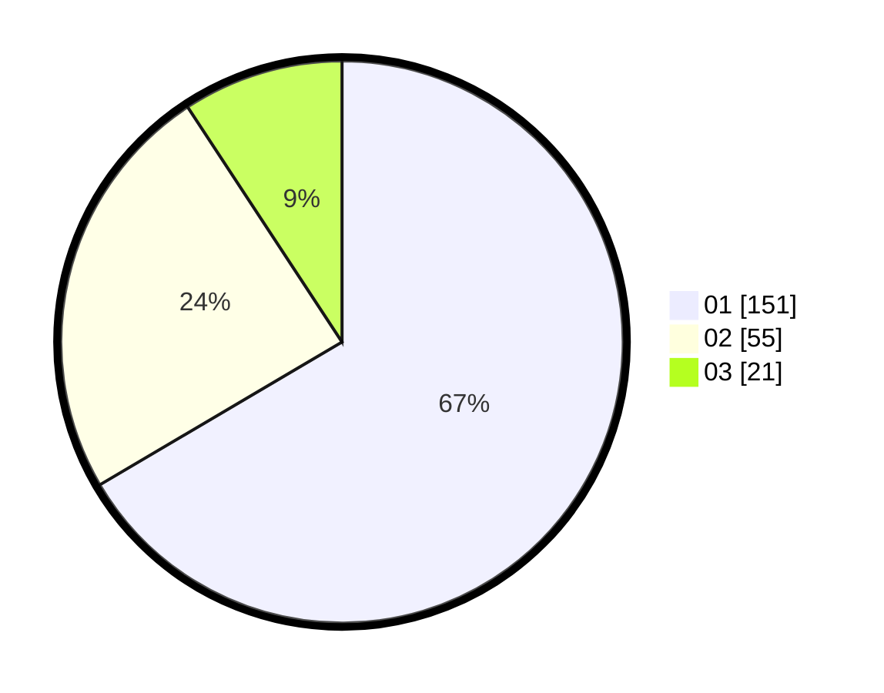

# Hasil

Hasil perolehan suara paslon dapat dilihat pada file paslon-01.txt, paslon-02.txt, dan paslon-03.txt.

Jika tidak ada, artinya data tersebut belum ada pada SIREKAP.

## Perolehan Suara

 * Paslon 01: **151**.
 * Paslon 02: **55**.
 * Paslon 03: **21**.

## Foto C Plano

https://sirekap-obj-formc.kpu.go.id/9be2/pemilu/ppwp/31/73/05/10/02/3173051002041-20240215-070015--b9d340fe-e7e7-4fb8-8d5c-995c628f6a9c.jpg

https://sirekap-obj-formc.kpu.go.id/9be2/pemilu/ppwp/31/73/05/10/02/3173051002041-20240214-193409--4846ea40-b074-4fd5-a6cc-a1cd5b642f9d.jpg

https://sirekap-obj-formc.kpu.go.id/9be2/pemilu/ppwp/31/73/05/10/02/3173051002041-20240214-193424--16d67ee8-e7f2-4c9e-8815-9ba24b3df0a1.jpg

## DATA PEMILIH TETAP

Jumlah pemilih dalam DPT: **285**.
 * L: **147**.
 * P: **138**.

## DATA PENGGUNA HAK PILIH

Jumlah pengguna hak pilih dalam DPT: **224**.
 * L: **121**.
 * P: **103**.

Jumlah pengguna hak pilih dalam DPTb: **2**.
 * L: **0**.
 * P: **2**.

Jumlah pengguna hak pilih dalam DPK: **1**.
 * L: **1**.
 * P: **0**.

Jumlah pengguna hak pilih: **227**.
 * L: **122**.
 * P: **105**.

## JUMLAH SUARA SAH DAN TIDAK SAH

JUMLAH SELURUH SUARA SAH: **227**.

JUMLAH SUARA TIDAK SAH: **0**.

JUMLAH SELURUH SUARA SAH DAN SUARA TIDAK SAH: **227**.
