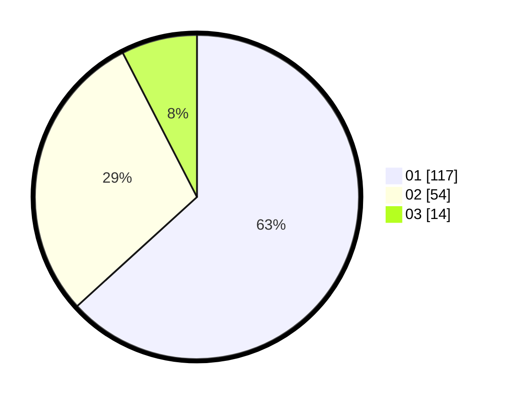

# Hasil

Hasil perolehan suara paslon dapat dilihat pada file paslon-01.txt, paslon-02.txt, dan paslon-03.txt.

Jika tidak ada, artinya data tersebut belum ada pada SIREKAP.

## Perolehan Suara

 * Paslon 01: **117**.
 * Paslon 02: **54**.
 * Paslon 03: **14**.

## Foto C Plano

https://sirekap-obj-formc.kpu.go.id/0718/pemilu/ppwp/31/73/05/10/02/3173051002058-20240214-222504--e2309c5d-c716-4c62-981f-d13768d8c74c.jpg

https://sirekap-obj-formc.kpu.go.id/0718/pemilu/ppwp/31/73/05/10/02/3173051002058-20240214-222655--b0453edc-3326-42a8-a5f8-f89e6821c121.jpg

https://sirekap-obj-formc.kpu.go.id/0718/pemilu/ppwp/31/73/05/10/02/3173051002058-20240214-223437--5875ba25-b5ae-441b-91d2-85bd1f498787.jpg
