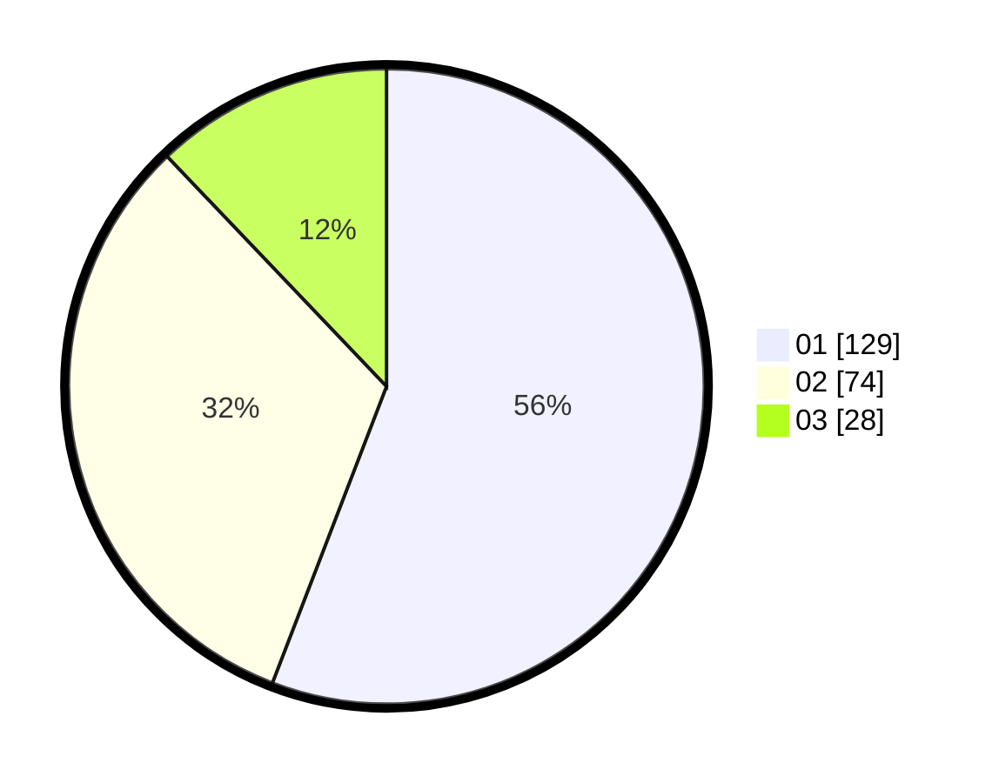

# Hasil

Hasil perolehan suara paslon dapat dilihat pada file paslon-01.txt, paslon-02.txt, dan paslon-03.txt.

Jika tidak ada, artinya data tersebut belum ada pada SIREKAP.

## Perolehan Suara

 * Paslon 01: **129**.
 * Paslon 02: **74**.
 * Paslon 03: **28**.

## Foto C Plano

https://sirekap-obj-formc.kpu.go.id/4934/pemilu/ppwp/31/73/05/10/02/3173051002067-20240214-214809--e8b70850-1153-4173-b754-6c9e724e9c04.jpg

https://sirekap-obj-formc.kpu.go.id/4934/pemilu/ppwp/31/73/05/10/02/3173051002067-20240214-213157--50a807d7-4d56-49fe-9043-5c6ba7fb0519.jpg
