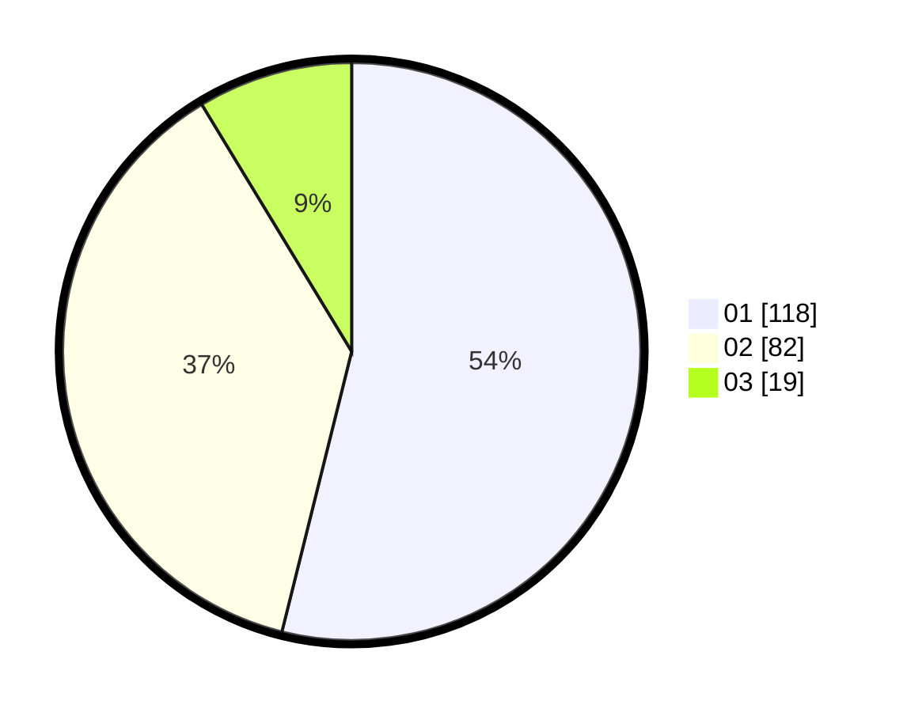

# Hasil

Hasil perolehan suara paslon dapat dilihat pada file paslon-01.txt, paslon-02.txt, dan paslon-03.txt.

Jika tidak ada, artinya data tersebut belum ada pada SIREKAP.

## Perolehan Suara

 * Paslon 01: **118**.
 * Paslon 02: **82**.
 * Paslon 03: **19**.

## Foto C Plano

https://sirekap-obj-formc.kpu.go.id/812b/pemilu/ppwp/31/73/05/10/02/3173051002070-20240215-025133--5dfeebf9-155e-4395-92bd-9761699d639c.jpg

https://sirekap-obj-formc.kpu.go.id/812b/pemilu/ppwp/31/73/05/10/02/3173051002070-20240215-013648--4fe3812a-7620-45ea-aabb-b4aa818fb4bf.jpg

https://sirekap-obj-formc.kpu.go.id/812b/pemilu/ppwp/31/73/05/10/02/3173051002070-20240215-013741--abad4149-2d9d-4bbf-b4e7-f66f5b456b69.jpg
