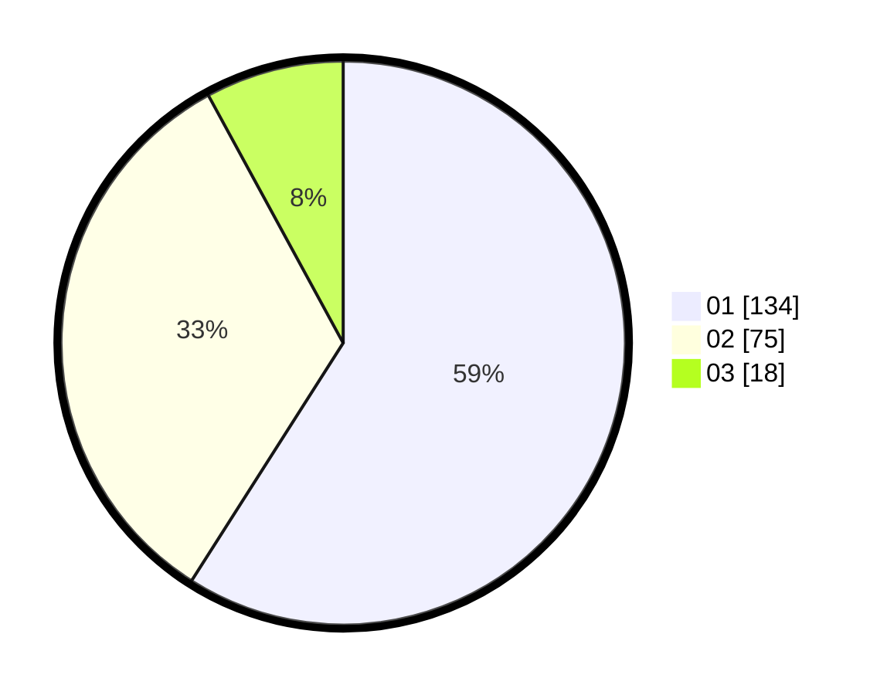

# Hasil

Hasil perolehan suara paslon dapat dilihat pada file paslon-01.txt, paslon-02.txt, dan paslon-03.txt.

Jika tidak ada, artinya data tersebut belum ada pada SIREKAP.

## Perolehan Suara

 * Paslon 01: **134**.
 * Paslon 02: **75**.
 * Paslon 03: **18**.

## Foto C Plano

https://sirekap-obj-formc.kpu.go.id/d86b/pemilu/ppwp/31/73/05/10/02/3173051002074-20240216-023747--d54994b8-7471-4d3b-9f1d-6a5dcea067fc.jpg

https://sirekap-obj-formc.kpu.go.id/d86b/pemilu/ppwp/31/73/05/10/02/3173051002074-20240214-202646--9c62984f-6a5b-44e2-9654-f82eb4e24c0a.jpg

https://sirekap-obj-formc.kpu.go.id/d86b/pemilu/ppwp/31/73/05/10/02/3173051002074-20240214-202816--bf09d593-fd25-4086-94ae-4ea6352e961c.jpg

## DATA PEMILIH TETAP

Jumlah pemilih dalam DPT: **287**.
 * L: **144**.
 * P: **143**.

## DATA PENGGUNA HAK PILIH

Jumlah pengguna hak pilih dalam DPT: **228**.
 * L: **115**.
 * P: **113**.

Jumlah pengguna hak pilih dalam DPTb: **0**.
 * L: **0**.
 * P: **0**.

Jumlah pengguna hak pilih dalam DPK: **0**.
 * L: **0**.
 * P: **0**.

Jumlah pengguna hak pilih: **228**.
 * L: **115**.
 * P: **113**.

## JUMLAH SUARA SAH DAN TIDAK SAH

JUMLAH SELURUH SUARA SAH: **227**.

JUMLAH SUARA TIDAK SAH: **1**.

JUMLAH SELURUH SUARA SAH DAN SUARA TIDAK SAH: **228**.
