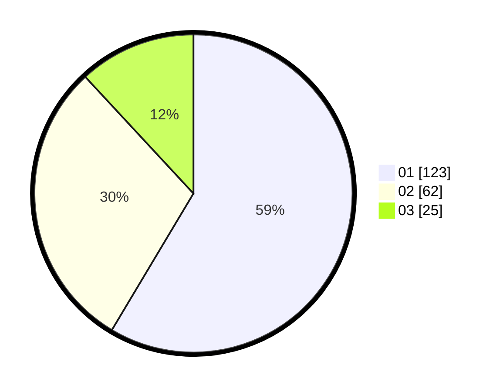

# Hasil

Hasil perolehan suara paslon dapat dilihat pada file paslon-01.txt, paslon-02.txt, dan paslon-03.txt.

Jika tidak ada, artinya data tersebut belum ada pada SIREKAP.

## Perolehan Suara

 * Paslon 01: **123**.
 * Paslon 02: **62**.
 * Paslon 03: **25**.

## Foto C Plano

https://sirekap-obj-formc.kpu.go.id/a7e9/pemilu/ppwp/31/73/05/10/02/3173051002081-20240214-192610--75251e68-fda3-4506-a023-3e687f8d1b0e.jpg

https://sirekap-obj-formc.kpu.go.id/a7e9/pemilu/ppwp/31/73/05/10/02/3173051002081-20240214-213422--b196de10-15fa-4c62-97e2-2e1264c11140.jpg

https://sirekap-obj-formc.kpu.go.id/a7e9/pemilu/ppwp/31/73/05/10/02/3173051002081-20240214-204214--ff4bb43d-667f-4f54-b051-2f73ae03d681.jpg

## DATA PEMILIH TETAP

Jumlah pemilih dalam DPT: **283**.
 * L: **135**.
 * P: **148**.

## DATA PENGGUNA HAK PILIH

Jumlah pengguna hak pilih dalam DPT: **207**.
 * L: **96**.
 * P: **111**.

Jumlah pengguna hak pilih dalam DPTb: **0**.
 * L: **0**.
 * P: **0**.

Jumlah pengguna hak pilih dalam DPK: **4**.
 * L: **1**.
 * P: **3**.

Jumlah pengguna hak pilih: **211**.
 * L: **97**.
 * P: **114**.

## JUMLAH SUARA SAH DAN TIDAK SAH

JUMLAH SELURUH SUARA SAH: **210**.

JUMLAH SUARA TIDAK SAH: **1**.

JUMLAH SELURUH SUARA SAH DAN SUARA TIDAK SAH: **211**.
