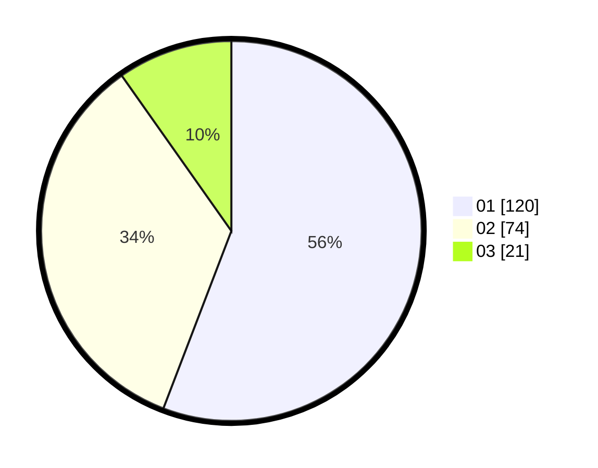

# Hasil

Hasil perolehan suara paslon dapat dilihat pada file paslon-01.txt, paslon-02.txt, dan paslon-03.txt.

Jika tidak ada, artinya data tersebut belum ada pada SIREKAP.

## Perolehan Suara

 * Paslon 01: **120**.
 * Paslon 02: **74**.
 * Paslon 03: **21**.

## Foto C Plano

https://sirekap-obj-formc.kpu.go.id/9932/pemilu/ppwp/31/73/05/10/02/3173051002085-20240215-022610--8661d4c0-134c-44c1-a1ae-75a38569053b.jpg

https://sirekap-obj-formc.kpu.go.id/9932/pemilu/ppwp/31/73/05/10/02/3173051002085-20240214-212354--6e7eb0ed-8eb0-4935-8418-375520f47e73.jpg

https://sirekap-obj-formc.kpu.go.id/9932/pemilu/ppwp/31/73/05/10/02/3173051002085-20240214-212404--16d15aef-1ca5-4d92-a5e1-5664b3008d60.jpg
