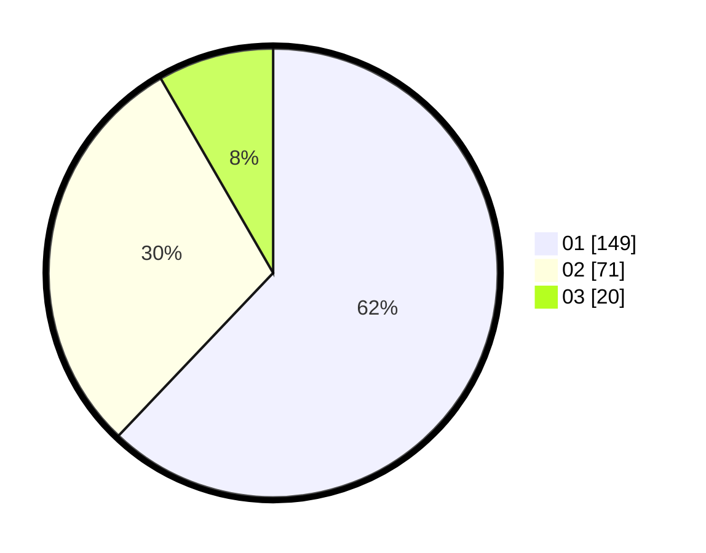

# Hasil

Hasil perolehan suara paslon dapat dilihat pada file paslon-01.txt, paslon-02.txt, dan paslon-03.txt.

Jika tidak ada, artinya data tersebut belum ada pada SIREKAP.

## Perolehan Suara

 * Paslon 01: **149**.
 * Paslon 02: **71**.
 * Paslon 03: **20**.

## Foto C Plano

https://sirekap-obj-formc.kpu.go.id/ec60/pemilu/ppwp/31/73/05/10/02/3173051002090-20240217-232004--fca79a75-5750-4474-ba6e-20c2787db397.jpg

https://sirekap-obj-formc.kpu.go.id/ec60/pemilu/ppwp/31/73/05/10/02/3173051002090-20240217-231911--bcfa5db6-0a1f-4c90-a95f-e86b6f386a81.jpg

https://sirekap-obj-formc.kpu.go.id/ec60/pemilu/ppwp/31/73/05/10/02/3173051002090-20240217-232054--ada337f0-3b11-4bb5-8098-d572654e1cc6.jpg
